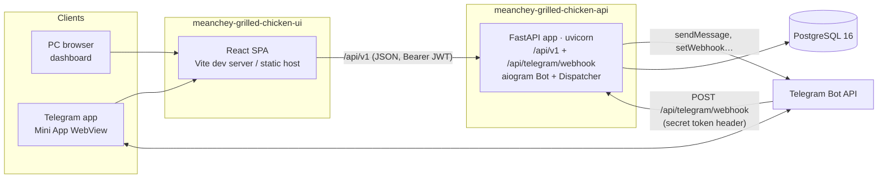
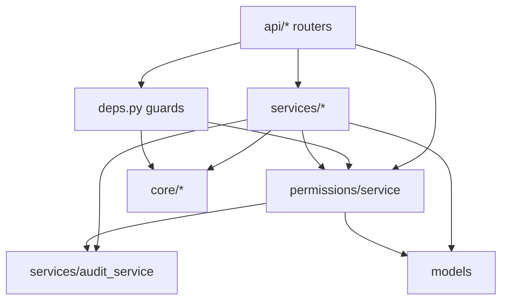
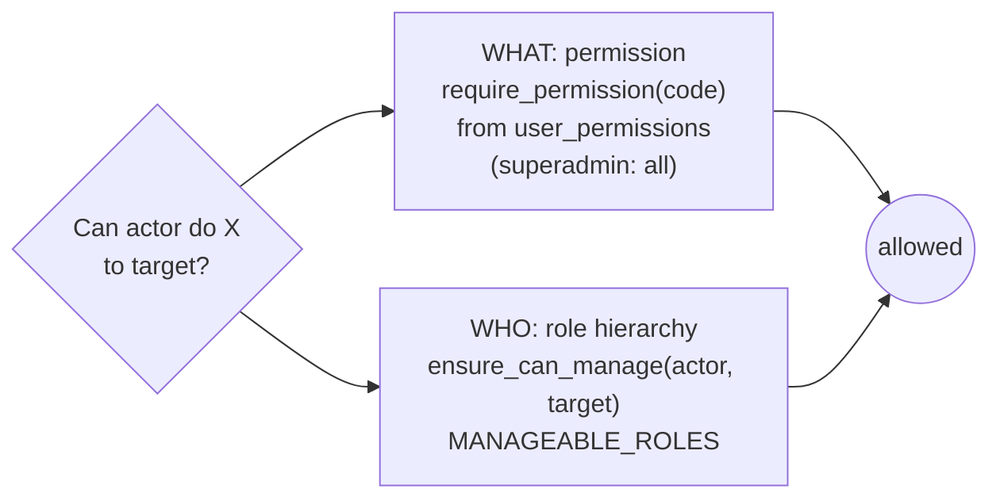
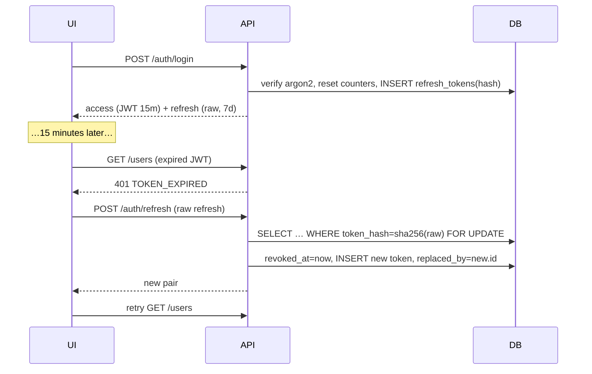
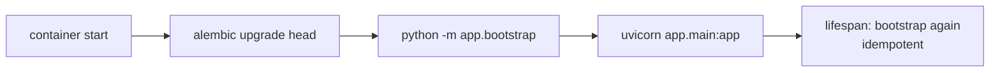
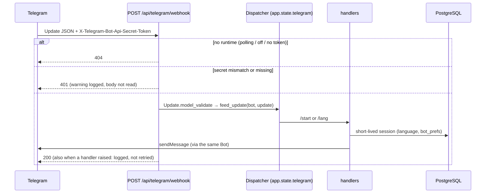

# API Architecture

How the Mean Chey Grilled Chicken API is put together, and why. For what it *does*, see [FEATURES.md](FEATURES.md).

- [1. System overview](#1-system-overview)
- [2. Tech stack](#2-tech-stack)
- [3. Code layout and layering](#3-code-layout-and-layering)
- [4. Request lifecycle](#4-request-lifecycle)
- [5. Data model](#5-data-model)
- [6. Authorization model](#6-authorization-model)
- [7. Authentication internals](#7-authentication-internals)
- [8. Startup and bootstrap](#8-startup-and-bootstrap)
- [9. Telegram bot](#9-telegram-bot)
- [10. Error handling](#10-error-handling)
- [11. Configuration](#11-configuration)
- [12. Testing strategy](#12-testing-strategy)
- [13. Deployment](#13-deployment)
- [14. Extending the system](#14-extending-the-system)
- [15. Design decisions](#15-design-decisions)

---

## 1. System overview



- In the default **webhook mode** there is **one process**: the FastAPI app serves the UI's JSON API and receives Telegram updates on `/api/telegram/webhook`. There is no separate bot process.
- The **UI** calls the API only through `/api/v1`. In development the Vite dev server proxies all of `/api` to the API, so one HTTPS tunnel (ngrok / cloudflared) serves the Mini App, `/api/v1` *and* the Telegram webhook.
- **Polling mode** (`BOT_MODE=polling`, local dev without a tunnel) adds back a separate `python -m app.bot` process from the same image. See §9.

## 2. Tech stack

| Concern | Choice |
|---|---|
| Language / runtime | Python 3.12 |
| Web framework | FastAPI, with Pydantic v2 schemas |
| Database | PostgreSQL 16 |
| ORM / driver | SQLAlchemy 2.x async + asyncpg |
| Migrations | Alembic (async `env.py`) |
| Password hashing | argon2-cffi (argon2id), with transparent rehash on login |
| Tokens | PyJWT (HS256) for access tokens; opaque random refresh tokens stored hashed |
| Bot | aiogram 3 |
| Config | pydantic-settings, reading `.env` |
| Tooling | uv (dependencies and lock), ruff (lint and format), pytest + pytest-asyncio + httpx |

## 3. Code layout and layering

```
app/
├── main.py              # create_app(): middleware, error handlers, routers, lifespan
├── config.py            # Settings (pydantic-settings), cached get_settings()
├── db.py                # async engine + SessionLocal + get_session dependency
├── bootstrap.py         # registry sync + superadmin seed (python -m app.bootstrap)
├── deps.py              # auth dependencies: CurrentUser, PendingUser, require_permission, require_role
├── core/
│   ├── errors.py        # ErrorCode enum, AppError, exception handlers
│   ├── security.py      # argon2, JWT encode/decode, refresh token generation/hashing
│   ├── telegram_auth.py # initData HMAC validation
│   ├── usernames.py     # Telegram username normalization/validation
│   └── phones.py        # phone normalization (storage) + formatting (phone_display)
├── models/              # SQLAlchemy ORM (User, Permission, UserPermission, RefreshToken, AuditLog, BotPref, AppSetting,
│                        #   Supplier + Customer via PartnerMixin, production batches + steps)
├── schemas/             # Pydantic request/response models; common.UserRef = the only user-reference shape
├── production/
│   └── catalog.py       # by-products and raw material kinds (code catalogs, no migration to extend)
├── permissions/
│   ├── registry.py      # PERMISSIONS, MODULES, FEATURES, DEFAULT_PERMISSIONS  ← feature authors edit this
│   ├── features.py      # feature access levels: current level, matrix, set_level (diff + feature.set audit)
│   ├── sync.py          # registry → DB sync + default backfill for new permissions
│   ├── hierarchy.py     # role scope: MANAGEABLE_ROLES, can_manage, ensure_can_manage
│   └── service.py       # effective permissions, grant/revoke rules, defaults, permission matrix
├── services/
│   ├── auth_service.py  # login (password/Telegram), tokens, change/reset password, /me
│   ├── user_service.py  # user CRUD, activation, resets, profile
│   ├── partner_service.py # generic supplier/customer CRUD, search, stats (PartnerKind)
│   ├── production_service.py # batches: drafts + versions, finish / reopen / cancel, codes, stats
│   ├── audit_service.py # record() + listing (viewer-aware filters)
│   └── redaction.py     # hides the superadmin from other viewers: viewer context, hides(), middleware
├── api/                 # thin routers: auth, me, users, permissions (superadmin), features, audit,
│                        #   partners (build_router(kind) → /suppliers, /customers), production
└── bot/
    ├── setup.py         # create_bot(), create_dispatcher(): the one place handlers are registered
    ├── handlers.py      # /start, /lang (create_router())
    ├── i18n.py          # bot texts (km/en)
    ├── webhook.py       # POST /api/telegram/webhook (secret check → dp.feed_update)
    ├── runtime.py       # TelegramRuntime (Bot + Dispatcher on app.state), create_runtime()
    ├── registration.py  # ensure_webhook / set / delete / info, fingerprint in app_settings
    └── __main__.py      # CLI: polling mode, `webhook set|delete|info`
```

**Layering rules**



- **Routers** are thin. They parse input with Pydantic, declare guards through dependencies, call one service function, and serialize the result.
- **Services** hold the business rules and own the transaction: they call `session.commit()`. Audit entries are added through `record()` inside the same transaction, so an action and its audit row commit or roll back together.
- **Guards** in `deps.py` and `permissions/hierarchy.py` are pure checks that raise `AppError`.
- **`core/`** has no dependency on models or services, apart from `errors`.
- **Redaction** sits at the serialization edge: `deps.get_current_user_allow_pending` records the viewer in a context variable (reset per request by `ViewerContextMiddleware`), and `UserRef`'s serializer hides the superadmin for any other viewer. Services never special-case it, except lookups (`get_user_or_404(..., viewer)`) and the audit filters.

## 4. Request lifecycle

```mermaid
sequenceDiagram
    participant C as Client
    participant F as FastAPI
    participant Dep as deps.py
    participant Svc as Service
    participant DB as PostgreSQL

    C->>F: PATCH /api/v1/users/{id} (Bearer JWT)
    F->>Dep: get_session() → AsyncSession (one per request)
    F->>Dep: get_current_user_allow_pending()
    Dep->>Dep: decode JWT (TOKEN_EXPIRED / INVALID_TOKEN)
    Dep->>DB: SELECT user by id
    Dep-->>F: 401 ACCOUNT_DISABLED if inactive
    F->>Dep: get_current_user()
    Dep-->>F: 403 PASSWORD_CHANGE_REQUIRED if pending
    F->>Dep: require_permission("users.update")
    Dep->>DB: effective permissions
    Dep-->>F: 403 MISSING_PERMISSION if missing
    F->>Svc: update_user(session, actor, target, body)
    Svc->>Svc: ensure_can_manage(actor, target) → FORBIDDEN_SCOPE
    Svc->>DB: UPDATE users …; INSERT audit_logs
    Svc->>DB: COMMIT
    F-->>C: 200 UserOut
```

- FastAPI caches a dependency per request, so the guard dependencies and the handler share the **same session**.
- Business-rule failures raise `AppError`, which becomes a JSON error (§10).

## 5. Data model

```mermaid
erDiagram
    users ||--o{ user_permissions : "holds"
    permissions ||--o{ user_permissions : "granted as"
    users ||--o{ user_permissions : "granted_by"
    users ||--o{ refresh_tokens : "has"
    users ||--o{ audit_logs : "actor"
    users ||--o{ audit_logs : "target"
    users ||--o{ users : "created_by"
    users ||--o{ suppliers : "created_by / updated_by"
    users ||--o{ customers : "created_by / updated_by"
    suppliers ||..o{ audit_logs : "entity (no FK)"
    customers ||..o{ audit_logs : "entity (no FK)"
    production_batches ||--|| production_raw_materials : "step 1"
    production_batches ||--o| production_outputs : "step 2"
    production_batches ||--o| production_packaging : "step 3"
    production_batches ||--o{ production_byproducts : "per catalog item"
    suppliers ||--o{ production_raw_materials : "supplier_id (RESTRICT)"
    users ||--o{ production_batches : "created_by / updated_by / cancelled_by"
    production_batches ||..o{ audit_logs : "entity (no FK)"

    users {
        uuid id PK
        user_role role "PG enum"
        varchar50 position "staff only, free-text label"
        varchar full_name
        varchar phone
        varchar telegram_username "normalized"
        bigint telegram_user_id "bound on first Mini App login"
        varchar password_hash "argon2id"
        bool must_change_password
        varchar language "km | en"
        bool is_active
        uuid created_by FK
        timestamptz created_at
        timestamptz updated_at
        timestamptz deleted_at
        int failed_login_count
        timestamptz locked_until
    }
    permissions {
        varchar code PK
        varchar module
        varchar name_en
        varchar name_km
        text description_en
        text description_km
        varchar_array assignable_to
        jsonb grantable_by "target role → grantor roles"
        bool is_active
    }
    user_permissions {
        uuid user_id PK,FK
        varchar permission_code PK,FK
        uuid granted_by FK
        timestamptz granted_at
    }
    refresh_tokens {
        uuid id PK
        uuid user_id FK
        varchar token_hash UK "sha256"
        timestamptz expires_at
        timestamptz revoked_at
        uuid replaced_by
    }
    audit_logs {
        bigint id PK
        uuid actor_id FK
        varchar action
        uuid target_user_id FK
        varchar entity_type "supplier | customer | production_batch"
        uuid entity_id "no FK"
        jsonb details
        timestamptz created_at
    }
    suppliers {
        uuid id PK
        varchar150 name
        varchar255 location
        varchar20 phone "normalized, unique among active"
        bool is_active
        timestamptz deleted_at
        uuid created_by FK
        uuid updated_by FK
        timestamptz created_at
        timestamptz updated_at
    }
    customers {
        uuid id PK
        varchar150 name
        varchar255 location
        varchar20 phone "normalized, unique among active"
        bool is_active
        timestamptz deleted_at
        uuid created_by FK
        uuid updated_by FK
        timestamptz created_at
        timestamptz updated_at
    }
    bot_prefs {
        bigint telegram_user_id PK
        varchar language
    }
    production_batches {
        uuid id PK
        varchar32 code UK "PR-YYYYMMDD-NNN"
        date production_date
        varchar status "in_progress | completed | cancelled"
        smallint current_step "1-3"
        varchar500 cancel_reason
        int version "optimistic concurrency"
        uuid created_by FK
        uuid updated_by FK
        uuid cancelled_by FK
        timestamptz created_at
        timestamptz updated_at
        timestamptz cancelled_at
        timestamptz completed_at
    }
    production_raw_materials {
        uuid batch_id PK,FK
        uuid supplier_id FK "null while draft"
        varchar material_kind "catalog code"
        numeric10_3 weight_kg
        int quantity
        varchar status "draft | finished"
        uuid finished_by FK
        timestamptz finished_at
        uuid updated_by FK
        timestamptz updated_at
    }
    production_outputs {
        uuid batch_id PK,FK
        numeric10_3 wings_kg
        numeric10_3 thighs_kg
        int wings_count "computed"
        int thighs_count "computed"
        numeric10_1 marinade_g
        varchar status
    }
    production_packaging {
        uuid batch_id PK,FK
        int big_packages
        int small_packages
        int rejected_wings
        int rejected_thighs
        text comment
        varchar status
    }
    production_byproducts {
        uuid batch_id PK,FK
        varchar item_code PK "catalog code"
        numeric10_3 produced_kg
        numeric10_3 carry_kg
        numeric10_3 rejected_kg
    }
    production_batch_counters {
        date day PK
        int last_number
    }
```



**Notes**

- **`role`** is a native PostgreSQL enum: roles are structural and change rarely.
- **`language`** is a `VARCHAR` validated by a Python enum, so new values need no migration.
- **`position`** is a free-text `VARCHAR(50)` job title for staff (migration `0002` widened it from 32).
  - It is normalized by `schemas.user.normalize_position`: trimmed, whitespace collapsed, case and Khmer kept.
  - It is a **label only**. Nothing in `permissions/`, `deps.py` or the services branches on its value, so it has no effect on access.
  - Only its *presence* is tied to the role: required for staff, forbidden otherwise (`ck_users_position_staff_only`).
  - `GET /users/positions` returns the distinct values for suggestions (case-insensitive grouping, most used spelling).
- **Partial unique indexes** enforce the business invariants. See FEATURES §3.
- **Uniqueness only counts active users,** so a deactivated user's username can be reused; that's how roles change in Phase 1.
- **`permissions` rows are never deleted.** Removing a permission from the registry flips `is_active`.
- **`suppliers` / `customers`** share their columns and indexes through `PartnerMixin` (`models/partner.py`), migration `0004`:
  - `ix_<table>_name_lower` on `lower(name)` for case-insensitive sorting and search;
  - `uq_<table>_active_phone`, a partial unique index on `phone` `WHERE is_active AND phone IS NOT NULL`: one active record per normalized number, per table;
  - `phone` stores the normalized form (digits, optional leading `+`); `phone_display` is computed on output.
- **Production** (`models/production.py`, migration `0005`):
  - one `production_batches` row per batch, and **one row per step** (`production_raw_materials`, `production_outputs`, `production_packaging`, PK = `batch_id`, `ON DELETE CASCADE`). A step's row is created when it becomes available (step 1 with the batch, step 2 when step 1 is first finished, step 3 when step 2 is), so "not started" is simply a missing row. All three step tables share `status` / `finished_by` / `finished_at` / `updated_by` / `updated_at` through `StepMixin`;
  - `production_byproducts`: one row per batch and catalog `item_code` (created on demand, so a new catalog entry needs no migration);
  - `production_batch_counters`: the last number used per production date, incremented with `INSERT … ON CONFLICT (day) DO UPDATE … RETURNING`. The row stays locked until the transaction ends, so concurrent creations on one day get distinct numbers; `uq_production_batches_code` is the safety net;
  - CHECK constraints keep statuses, `current_step` (1–3) and all quantities ≥ 0 valid even outside the API;
  - the relationships load with `selectin`, so a batch arrives with all its steps (no lazy loads under asyncio).
- **Weights are `Decimal` end to end:** `NUMERIC(10,3)` for kg and `NUMERIC(10,1)` for grams in the database, `Decimal` in Python (never `float`), accepted by Pydantic from JSON numbers or strings with `max_digits` / `decimal_places`, and serialized as fixed-precision strings (`"12.500"`, `"350.0"`) through a `PlainSerializer`. The UI parses them into scaled integers for exact sums.
- **`audit_logs.entity_type` / `entity_id`** (indexed together as `ix_audit_logs_entity`) reference non-user records. There is no foreign key because one column pair points into several tables; the audit listing resolves current names with one query per entity type (`ENTITY_LABELS`: `suppliers.name`, `customers.name`, `production_batches.code`).
- **Constraint naming.** All constraints follow a naming convention (`ix_`, `uq_`, `ck_`, `fk_`, `pk_`), which keeps Alembic autogenerate deterministic.
- **Timestamps** are `timestamptz`. The app sets them in Python (UTC) and also has server defaults. Setting them in Python avoids lazy loads after `commit` under asyncio (`expire_on_commit=False`).

## 6. Authorization model

Authorization combines **two independent axes**, plus a **feature layer** on top of permissions for the general manager:

**The superadmin can do everything the general manager can.** It holds every permission implicitly, manages every other role, and every `require_role(...)` that lists `general_manager` also lists `superadmin` (the audit log). Role checks on `general_manager` in services are business rules (one active GM), never access checks. `tests/test_superadmin_superset.py` enforces this for every route, including future ones (§12).



| Layer | Where | Answers |
|---|---|---|
| `require_permission(*codes)` | `deps.py` | Does the actor hold the feature permission? |
| `require_role(*roles)` | `deps.py` | Coarse role gate, e.g. the audit log |
| `ensure_can_manage(actor, target)` | `permissions/hierarchy.py` | Is the target strictly below the actor? |
| `ensure_can_manage_role(actor, role)` | `permissions/hierarchy.py` | Can the actor create or filter this role? |
| Detailed grant rules | `permissions/service.py` | Superadmin only (`require_role`). Held-by-grantor, `grantable_by`, target active, `assignable_to` |
| Feature levels | `permissions/features.py` | GM (and superadmin): set Off / View only / [Record /] Full access; diff within the feature's codes |
| Redaction | `services/redaction.py`, `schemas/common.py` | Hides the superadmin from every other viewer |

### How effective permissions are computed

```sql
SELECT up.permission_code
FROM user_permissions up JOIN permissions p ON p.code = up.permission_code
WHERE up.user_id = :uid
  AND p.is_active
  AND :role = ANY(p.assignable_to)
```

The superadmin short-circuits to "all active permissions".

### Grant rule order

Detailed permissions are the superadmin's tool: the four endpoints are guarded by `require_role(superadmin)`. Behind that guard, `block_reason(actor, actor_perms, target, perm)` returns the first failing rule, and both the grant/revoke endpoints and the permission matrix (`can_edit` + `reason`) use it:

| # | Rule | Error |
|---|---|---|
| 1 | Actor holds `permissions.grant` (route guard) | `MISSING_PERMISSION` |
| 2 | Target is in the actor's scope | `FORBIDDEN_SCOPE` |
| 3 | Permission exists and is active (endpoints only) | `PERMISSION_NOT_FOUND` |
| 4 | Actor holds the permission (grant and revoke) | `PERMISSION_NOT_HELD` |
| 5 | `grantable_by[target.role]`, if present, lists the actor's role (grant and revoke; superadmin exempt) | `PERMISSION_GRANT_RESTRICTED` |
| 6 | Grant only: target is active | `USER_INACTIVE` |
| 7 | Grant only: target's role is in `assignable_to` | `PERMISSION_NOT_ASSIGNABLE` |

`grantable_by` refines *who may hand out* a permission for particular target roles, without touching the role hierarchy. No permission uses it now (it used to keep partner permissions away from staff unless the superadmin granted them); the mechanism stays. Features can't contain such permissions (startup validation), because a level change doesn't apply per-permission grant rules.

### Feature layer

```mermaid
flowchart LR
    GM[General manager<br/>Access tab] -->|PUT /users/{id}/features/{f}| F[features.set_level]
    SA[Superadmin<br/>Permissions (advanced)] -->|PUT/DELETE /users/{id}/permissions/{code}| G[service.grant / revoke]
    F -->|diff: insert / delete<br/>only the feature's codes| UP[(user_permissions)]
    G --> UP
    UP -->|effective permissions| ME[/auth/me → menus, guards/]
```

- A feature (`registry.FEATURES`) maps each level to an exact set of codes. Levels come from `LEVELS = (off, view, record, full)` in that order; a feature starts with `off` and may omit any of the others (only `production` has `record` = view + create). `current_level` = the level whose set equals the user's effective codes within the feature, else `custom`; this works unchanged for any number of levels.
- `set_level` checks, in order: scope (`FORBIDDEN_SCOPE`; the hidden account is already `USER_NOT_FOUND`), `FEATURE_NOT_FOUND`, `FEATURE_NOT_APPLICABLE`, unknown level (`VALIDATION_ERROR`), target active (`USER_INACTIVE`). The level is a plain string in the body so this order holds.
- Unlike detailed grants there is **no held-by-grantor rule**: whoever holds `permissions.grant` (the general manager) can set any level of any applicable feature. Detailed permissions keep `PERMISSION_NOT_HELD` and are superadmin-only anyway.
- **Role changes** (`user_service.change_role`) call `service.reset_to_role_defaults`: all grants are replaced by `DEFAULT_PERMISSIONS[new role]` (not limited to what the actor holds), in the same transaction as the role update and the `user.role_change` audit entry.
- The diff touches only the feature's codes, in one transaction, with one `feature.set` audit entry and no `permission.*` entries. Re-setting the current level writes nothing.
- `DEFAULT_PERMISSIONS` for supervisors and staff is computed from feature levels (supervisor: all Full; staff: all Off).

The query filters on `is_active` and `assignable_to` **at read time**, not only when a grant is made. So if a registry change deactivates a permission or narrows its `assignable_to`, existing grants stop working immediately, with no data migration. That's how supervisors lost `permissions.grant` and `users.delete`: the rows remain, the effect is gone.

## 7. Authentication internals

### 7.1 Token design



- **Stateless access tokens:** no database hit to validate the signature. The user row is still loaded on each request to check `is_active` and `must_change_password`.
- **Refresh tokens:**
  - **Hashing.** They are hashed with SHA-256 rather than argon2: they are high-entropy random values, so a fast hash is enough, and it lets them be looked up by an indexed equality match.
  - **Row lock.** `SELECT … FOR UPDATE` prevents double-spending one token under concurrent refreshes.
  - **Mass revocation** is a single `UPDATE … WHERE user_id = … AND revoked_at IS NULL`. It runs on deactivation, password reset and "log out everywhere".

### 7.2 Lockout

- **Race handling.** The login flow selects the user `FOR UPDATE`, so concurrent attempts are serialized per account.
- **Commit before rejecting.** The failure count and lock are committed *before* the error is raised, so a rejected login still persists its side effects.

### 7.3 Telegram initData

`core/telegram_auth.validate_init_data` is a pure function, unit-tested with generated payloads:

1. Parse the query string strictly.
2. Pop `hash`.
3. Build `data_check_string` from the sorted `key=value` pairs, joined by `\n`.
4. `secret = HMAC_SHA256(key="WebAppData", msg=bot_token)`.
5. Compare `HMAC_SHA256(secret, data_check_string)` against `hash` in constant time.
6. Check that `auth_date` is fresh, then parse `user`.

## 8. Startup and bootstrap



`bootstrap()` does five things:

1. `SELECT pg_advisory_xact_lock(815001)`: serializes concurrent starts, for example several workers or replicas, or the api and a migration job.
2. `validate_features()` (also at import) and `sync_registry()`: checks FEATURES against PERMISSIONS, then upserts the registry (including `grantable_by`) and deactivates entries that were removed. It returns the codes it **inserted**.
3. `backfill_defaults(new_codes)`: grants each newly inserted permission to every active user whose role has it in `DEFAULT_PERMISSIONS` (`granted_by = NULL`, `INSERT … ON CONFLICT DO NOTHING`), with a `permission.grant` audit entry per grant (`details.source = "default_backfill"`). Because it only sees codes inserted by this run, it grants nothing on later starts, and a manual revoke stays revoked.
4. `seed_superadmin()`: creates the superadmin if none exists, with `must_change_password = false`.
5. **Webhook registration**, only when `BOT_MODE=webhook`, a token is set and `TELEGRAM_WEBHOOK_AUTO_SET=true`. `ensure_webhook()`:
   1. calls `getWebhookInfo`;
   2. calls `setWebhook(url, secret_token, allowed_updates=dp.resolve_used_update_types(), drop_pending_updates)` and `setMyCommands` only if **any** of these differ:
      - the URL;
      - the allowed updates;
      - the fingerprint stored in `app_settings`, a SHA-256 of URL, secret, allowed updates and drop-pending. Telegram never returns the secret, so this is the only way to detect a rotated secret.
   - Every Telegram call has a 10 s timeout. **Any failure is logged and swallowed**, so the API still comes up.
   - Because this runs under the advisory lock, several workers starting together register once. The rest see the matching fingerprint and skip.

It then commits. The whole thing is idempotent.

- It also runs inside the FastAPI lifespan, so a plain `uvicorn` run in development gets the same guarantees.
- The lifespan creates the `TelegramRuntime` first (webhook mode only) and passes it in, so registration and request handling use the same `Bot` and `Dispatcher`.
- When run as `python -m app.bootstrap`, a short-lived `Bot` is created for registration and then closed.

## 9. Telegram bot

### 9.1 Webhook mode (default)



- **Lifecycle.** The FastAPI lifespan builds one `TelegramRuntime` per process: a `Bot` and a `Dispatcher` from `bot/setup.py`. It is stored on `app.state.telegram`, and the bot's HTTP session is closed on shutdown.
- **The endpoint** lives outside `/api/v1`: it isn't part of the versioned public API. It is still under `/api`, so the Vite dev proxy and a same-origin production setup both reach it through one HTTPS domain.
  - It is hidden from OpenAPI and uses no auth dependencies. It is authenticated only by the secret token, compared with `hmac.compare_digest`.
- **Inline processing.** Updates are handled inline in the request, with no background queue. Handlers are short (one database session each), well within Telegram's timeout.
- **Handlers** (`bot/handlers.py`) are stateless and are registered only in `create_dispatcher()`. `create_router()` returns a fresh router each time, because an aiogram router can only have one parent.
- **Shared data.** The bot reuses `app.db.SessionLocal` and the models: there is one source of truth for users and their language.
- **Bot texts** live in `bot/i18n.py`, separately from the UI translations.

### 9.2 Polling mode (fallback for local development)

- `BOT_MODE=polling` + `python -m app.bot` (compose: `docker compose --profile polling up`).
  - It deletes any registered webhook, clears the stored fingerprint, sets the commands, then long-polls with the **same** `create_dispatcher()`.
  - In this mode the API creates no runtime, so the webhook endpoint returns 404 and nothing is registered at startup.
- The whole stack must use `BOT_MODE=polling`. If the API still runs in webhook mode, it re-registers the webhook on its next restart, and Telegram then rejects `getUpdates`. The poller logs a warning when it finds a webhook registered.
- **Only one polling instance** per bot token may run: Telegram rejects concurrent `getUpdates` calls.

### 9.3 Scaling

In webhook mode the API can run **multiple uvicorn workers or replicas**.

- Each worker has its own `Bot` and `Dispatcher`, and Telegram delivers each update to whichever worker the load balancer picks.
- Handlers keep no in-process state, so no coordination is needed.
- Startup registration is serialized by the bootstrap advisory lock (§8).

## 10. Error handling

- Domain errors are raised as `AppError(status, ErrorCode, message, details)`.
- Handlers in `core/errors.py` map these to JSON:

  | Raised | Response |
  |---|---|
  | `AppError` | `{"error": {"code", "message", "details?"}}` |
  | `RequestValidationError` | `422 VALIDATION_ERROR`, with `details.fields[] = {loc, type, msg}` |
  | Starlette `HTTPException` | `NOT_FOUND`, `METHOD_NOT_ALLOWED` or `HTTP_ERROR` |

- **Database constraint violations become API errors.** `_flush_or_conflict` in `user_service` catches `IntegrityError` and maps the name of the violated partial unique index to a domain code (`GM_ALREADY_EXISTS`, `DUPLICATE_TELEGRAM_USERNAME`).
  - The code also checks these conditions up front, for friendly errors.
  - The database index is the real guarantee under concurrency.

## 11. Configuration

- **Source:** all settings live in `app/config.py` (`Settings`).
- **Where values come from:** environment variables first, then `.env`.
- **Access:** through the cached `get_settings()`.
- **Required:** `JWT_SECRET`. In webhook mode with a bot token, also `TELEGRAM_WEBHOOK_URL` and `TELEGRAM_WEBHOOK_SECRET`.
- **Full list:** in the README.

**API docs**

| Setting | Default | Notes |
|---|---|---|
| `ENVIRONMENT` | `development` | Set `production` in production. |
| `API_DOCS_ENABLED` | unset | `true` / `false` forces `/docs`, `/redoc`, `/openapi.json` on or off. Unset: on only when `ENVIRONMENT=development`. The schema lists every role, so it stays off in production. |

**Business settings**

| Setting | Default | Notes |
|---|---|---|
| `BUSINESS_TIMEZONE` | `Asia/Phnom_Penh` | IANA zone for business calendars, e.g. the "new this month" figure on suppliers and customers. Validated at startup. Zone data comes from the `tzdata` package, so it works on Windows and slim images too. |

**Telegram bot settings**

| Setting | Default | Notes |
|---|---|---|
| `BOT_MODE` | `webhook` | `webhook` \| `polling` \| `off` |
| `TELEGRAM_WEBHOOK_URL` | empty | Full public URL, e.g. `https://example.com/api/telegram/webhook`. Must be `https` on port 443, 80, 88 or 8443. |
| `TELEGRAM_WEBHOOK_SECRET` | empty | 1–256 chars `[A-Za-z0-9_-]`. Generate with `python -c "import secrets; print(secrets.token_urlsafe(32))"`. |
| `TELEGRAM_WEBHOOK_AUTO_SET` | `true` | Register or refresh the webhook during bootstrap. |
| `TELEGRAM_DROP_PENDING_UPDATES` | `false` | Passed to `setWebhook`. |

**Startup validation.** A `model_validator` on `Settings` checks the URL and secret whenever `webhook_enabled` is true (webhook mode and a token is set).

- A misconfigured deployment fails at startup with a clear message, rather than silently never receiving updates.
- Every entry point that loads settings fails this way, including Alembic and the CLI.
- With `polling` / `off`, or with no token, the webhook values are not checked.

Settings are read at import time by `app.db` to build the engine. Tests therefore set environment variables at the top of `tests/conftest.py`, *before* importing `app`.

## 12. Testing strategy

| Aspect | Approach |
|---|---|
| Database | A real PostgreSQL (`TEST_DATABASE_URL`). The partial indexes, `ANY(array)` and `FOR UPDATE` are Postgres-specific. |
| Schema | A session fixture drops the `public` schema, then runs **Alembic `upgrade head`**. This tests the migration too. |
| Isolation | Before each test: `TRUNCATE … RESTART IDENTITY CASCADE`, then `bootstrap()`. |
| Engine | `DB_NULL_POOL=true` avoids connection reuse across pytest-asyncio event loops. |
| HTTP | `httpx.AsyncClient` over `ASGITransport(app)`: in-process, no server. |
| Auth in tests | `auth(user)` mints an access token directly. Login flows have their own tests. |
| Coverage focus | Scope matrix for every role pair; grant rules; defaults; DB invariants; forced password change; lockout; Telegram valid / tampered / expired / binding; normalization; deactivation; resets; audit access; webhook secret / dispatch / errors / modes; webhook registration; bot settings validation; default backfill, `grantable_by` and `reason`; suppliers/customers CRUD, validation, phone rules, duplicates, search/sort/paging, stats month boundary, audit entities (parametrized over both lists); feature levels (mapping, diffs, check order, defaults, startup validation); detailed permissions superadmin-only; **superadmin invisibility sweep** over every GET route from the OpenAPI schema plus key mutations, as GM / supervisor / staff; **superadmin ⊇ GM sweep** (`test_superadmin_superset.py`): every route and method in the schema is called as the GM and, wherever the GM isn't refused with 403, as the superadmin, which must not get 403 either (placeholders filled with targets both manage; empty bodies unless a valid one is needed to reach a service-level check; both accounts reset between calls); production steps, drafts, versions, edit-reopen, cancel (GM only), codes under concurrency, stats; GM feature levels set by the superadmin. |
| Telegram | Never contacted. `tests/telegram_fakes.RecordingSession` is an aiogram `BaseSession` that records Bot API calls (`SendMessage`, `SetWebhook`, …) and returns canned responses, or simulates an outage. `BOT_MODE=off` by default; webhook tests put their own `TelegramRuntime` on `app.state`. |

Run:

```bash
uv run pytest
```

Lint and format:

```bash
uv run ruff check . && uv run ruff format --check .
```

## 13. Deployment

- **Image:** one image (`Dockerfile`, `python:3.12-slim` + uv, frozen lockfile, no dev dependencies) serves both the `api` and the optional `bot-polling` service.
- **Default stack** (`docker compose up`): `postgres` + `api`.
  1. `postgres` becomes healthy.
  2. `api` runs migrations and bootstrap (including webhook registration), then becomes healthy on `/health`.
- **Polling profile** (`docker compose --profile polling up`, with `BOT_MODE=polling` in `.env`): adds `bot-polling`, which starts after `api` is healthy.
- **Network:** the `api` container needs **outbound HTTPS to `api.telegram.org`** (for `setWebhook` and `sendMessage`), and **inbound HTTPS from Telegram** on the public URL.
- **Production notes:**
  - Put the API behind a TLS-terminating reverse proxy that forwards `/api/*`, including `/api/telegram/webhook`.
  - Serve the UI on the same origin under `/`, and the API under `/api`. Otherwise configure `CORS_ORIGINS`.
  - Use a strong `JWT_SECRET`. Rotating it invalidates all access tokens; refresh tokens keep working.
  - Rotating `TELEGRAM_WEBHOOK_SECRET` needs no extra step: the next start detects the new fingerprint and re-registers.
  - Scaling: see §9.3. Webhook mode supports multiple workers or replicas; polling mode must stay single-instance.
  - `.env` is read only when a container is **created**. After changing it, use `docker compose up -d --force-recreate <service>`, not `restart`.

## 14. Extending the system

To add a business feature, for example `orders`:

1. **Registry:** add a `ModuleDef` and `PermissionDef`s (with `assignable_to`) to `permissions/registry.py`, **and a `FeatureDef`** in `FEATURES` (`menu`, `applies_to`, levels `off` / `view` / `full` → codes) so the general manager can switch it on the Access tab. `menu` is `"workstation"` for day-to-day work (e.g. `FeatureDef(code="orders", menu="workstation", …)`) or `"settings"` for administration; a new menu goes into both `Menu` and `MENUS` (the display order). Startup validation checks the feature against the permissions. Update `DEFAULT_PERMISSIONS` (supervisor/staff defaults are built from feature levels). There is no migration for permissions.
2. **Models and migration:** add the feature's tables in `models/`, then:
   ```bash
   uv run alembic revision --autogenerate -m "orders"
   ```
3. **Service and router:** add the service in `services/` and the router in `api/`. Every user reference in a response must be a `schemas.common.UserRef`, and per-user lookups must pass the viewer (`get_user_or_404(session, id, actor)`), so the superadmin stays hidden (the redaction sweep test will catch misses). Guard the routes with `require_permission("orders.view")`. Call `ensure_can_manage` whenever acting on another user's data. Record audit entries for sensitive actions.
   - **New permissions reach existing users automatically** when you list them in `DEFAULT_PERMISSIONS`: the next start backfills them (§8).
   - To keep a permission away from some roles unless a specific role grants it, set `grantable_by`.
4. **Tests:** permission denied, scope, and the happy path.

**Pattern: several lists with the same shape.** Suppliers and customers are one implementation:

- `models/partner.py`: `PartnerMixin` declares the columns and per-table indexes; `Supplier` and `Customer` only set `__tablename__`.
- `services/partner_service.py`: every rule takes a `PartnerKind(model, entity, prefix, not_found)`.
- `api/partners.py`: `build_router(kind)` creates the seven routes, guarded by `<prefix>.view|create|update|delete`.
- `tests/test_partners.py` runs every test against both kinds.

A third list with the same fields needs a model class, a `PartnerKind`, a router mount, the registry entries, a migration and translations.
5. **UI:** route guard, menu entry, `<Can>`, translations. See the UI's ARCHITECTURE.md.

**Adding a by-product or a raw material kind** (production): add a `ByproductDef` (code, names, unit, order) or a `MaterialKindDef` (code, names, wings / thighs per unit) to `app/production/catalog.py`. No migration: by-product rows are keyed by `item_code` and created on demand, and every batch response carries the catalog, so the UI shows the new row automatically (add a `production.materialKinds.<code>` label in the UI locales if you want a translated kind name). Existing finished batches simply have no row for the new item; the new item becomes required at the next Finish of step 2 / step 3.

**Adding a feature level:** levels are the fixed ordered list `LEVELS` in `registry.py`; a feature lists the ones it uses (e.g. production uses `record`). A new level name needs an entry in `LEVELS`, in the UI's `FeatureLevel` type and `access.levels.<name>` translations.

## 15. Design decisions

| Decision | Rationale |
|---|---|
| Permissions defined in code, mirrored to the database | Code review covers every permission change, deployment is reproducible, and the database still supports foreign keys and grant history. |
| Role hierarchy separate from permissions | Keeps "who" (organizational structure) and "what" (features) orthogonal, so each can change independently. |
| Invariants in database indexes, not only in code | Race-proof: two concurrent "create GM" requests cannot both succeed. |
| Uniqueness only among active users | Supports "deactivate and recreate" without renaming old records. |
| Role change resets access to the new role's defaults | A promoted or demoted user never keeps access meant for the old role (leftover rows would silently come back if the role changed again). The general manager fine-tunes afterwards with feature levels. |
| Reload the user on every request | Deactivation and forced password change take effect instantly. The cost is one primary-key lookup. |
| Opaque, hashed, rotating refresh tokens | A database leak doesn't expose usable tokens, and each token can be revoked individually. |
| No cascade on revoke | Predictable behavior. Follow-up is surfaced through the audit log instead of silently removing other people's access. |
| Superadmin is implicit-all | New features are immediately available to the superadmin without extra grants. |
| Stable error codes, English message | The UI owns translation, and API consumers get a machine-readable contract. |
| One image for api and bot | Shared models and config, with no version drift between the API and the optional polling process. |
| Webhook in FastAPI instead of a polling process | One process fewer to deploy and monitor. It scales with the API's workers and replicas, where polling allows only one instance. Updates arrive over the same HTTPS domain as the UI and API. Telegram pushes updates instead of the bot holding a long poll open. Polling stays available as a local-dev fallback, using the same dispatcher setup. |
| Webhook fingerprint stored in the database | `getWebhookInfo` can't reveal the secret. A SHA-256 fingerprint in `app_settings` detects secret changes without calling `setWebhook` on every start. |
| Feature levels also for the GM, set by the superadmin | The superadmin controls the GM with the same simple levels the GM uses for its team, instead of permission codes. The role scope (only the superadmin manages the GM) keeps the GM from changing its own access with no extra rule. GM-only powers stay detailed permissions, so a level change can't grant or remove them by accident. |
| Editing a finished step reopens every later step | Later steps were computed from the earlier one (counts, balances). Reopening them together, with values kept, is one action for the user and guarantees they are checked again, instead of a chain of reopen clicks in reverse order. |
| Cancelling batches is GM-only | Cancelling removes a batch from the figures: a management decision, like deactivating people. Outside the feature levels, so a supervisor at Full access can fix steps but not cancel. |
| Feature levels for managers, detailed permissions for the superadmin | Managers think in "who can use Suppliers, and how much", not in permission codes. Levels are exact code sets over the same `user_permissions` table, so nothing else changes and the superadmin can still fine-tune (shown as `custom`). |
| Superadmin redacted for all other viewers | The superadmin is an operator account, not part of the business. Hiding it at the serialization edge (one `UserRef` schema, one lookup helper, fail-closed) covers new endpoints by default, and a route-walking test guards against regressions. |
| Supervisors never deactivate users or grant access | Keeps people decisions with the general manager. Enforced by `assignable_to`, so older grants lose their effect without a data migration. |
| Backfill role defaults only for newly inserted permissions | New features reach existing managers on deploy with no manual grants, and it runs exactly once per permission, so a later deliberate revoke is never undone by a restart. |
| `grantable_by` on the permission, not a new role rule | Keeps the hierarchy (who manages whom) unchanged, and restricts only the permissions that need it, per target role. The superadmin is exempt, matching "implicit-all". Unused today; kept for later. |
| Separate `suppliers` and `customers` tables, one generic implementation | Each list gets its own ids, indexes and future columns, while the code and tests are written once. |
| Phones stored normalized, displayed formatted | Search and the uniqueness index work on one canonical form, whatever separators people type. |
| Production as a batch with one row per step | The three steps have different fields, owners and lifecycles (draft / finished, reopen). One table per step keeps each typed and constrained, a missing row means "not started", and a batch loads with all steps at once. |
| Server-side drafts with a batch `version` | Autosave needs the half-filled form on the server (the Mini App may be closed any time, work continues on another device). Optimistic versioning (`409 PRODUCTION_CONFLICT` with the current batch) is simpler than locking a batch to one user and still prevents silent overwrites; the row lock (`FOR UPDATE`) serializes concurrent writes. |
| Piece counts computed by the server | `wings_count` / `thighs_count` follow from the chicken count; accepting them from clients would let the balance check be bypassed. |
| By-product kg balance enforced by the UI only (for now) | Weights are measured on a scale and may legitimately not add up exactly; the business may relax the rule. Keeping it out of the API means that change is UI-only; a test documents that the API accepts it. |
| Batch code from a per-day counter row | Readable, gap-free per day and race-safe (`ON CONFLICT … RETURNING`), without a sequence per day. |
| Always `200` once the secret is valid | Telegram retries non-2xx responses, so a failing handler would otherwise replay the same update in a loop. Failures are logged instead. |
