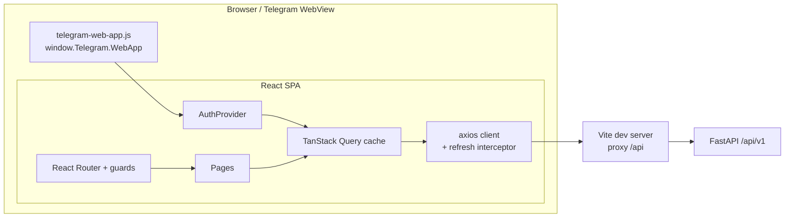
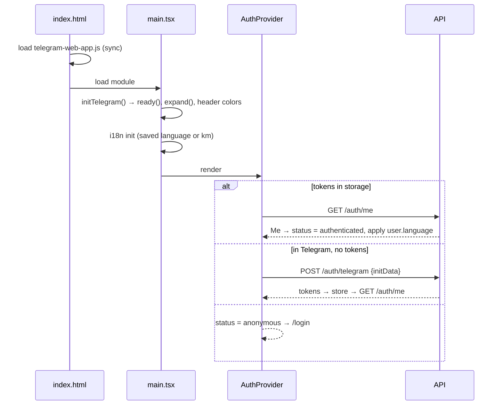
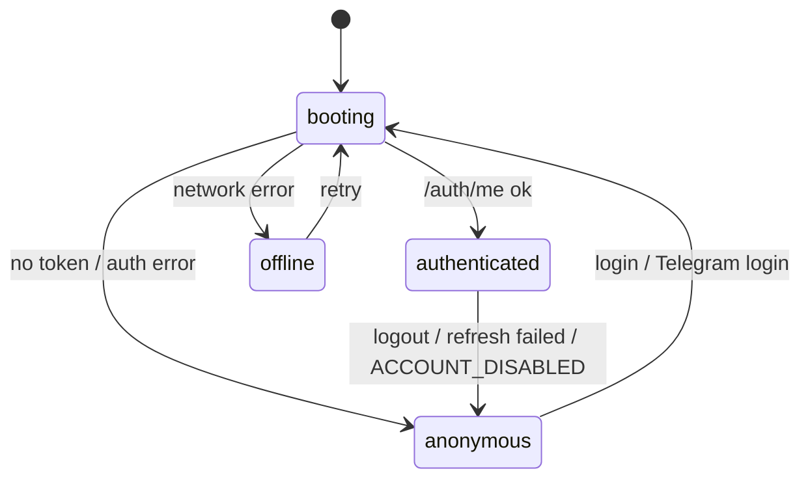
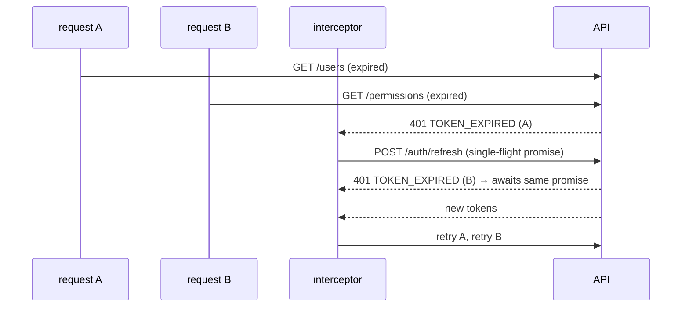
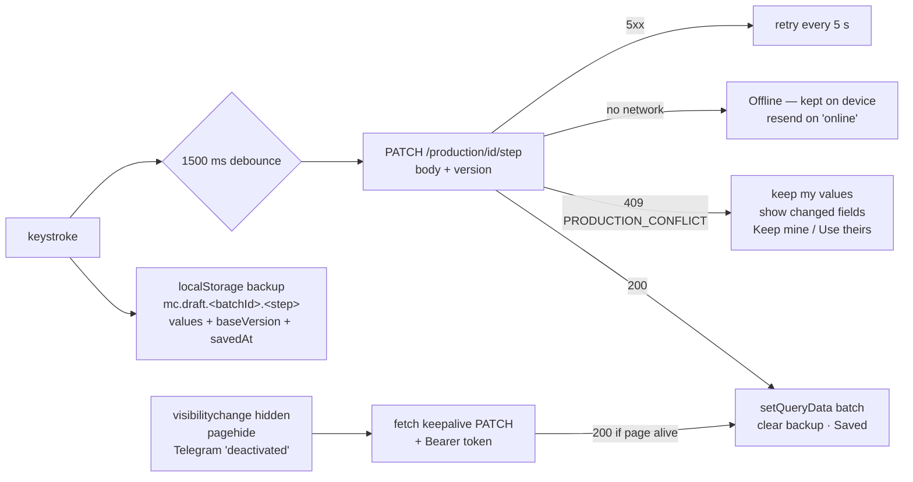

# UI Architecture

How the Mean Chey Grilled Chicken UI is built. For what it *does*, see [FEATURES.md](FEATURES.md). For the backend, see `../meanchey-grilled-chicken-api/docs/ARCHITECTURE.md`.

- [1. Overview](#1-overview)
- [2. Tech stack](#2-tech-stack)
- [3. Source layout](#3-source-layout)
- [4. Boot sequence](#4-boot-sequence)
- [5. Session and auth state](#5-session-and-auth-state)
- [6. API client and token refresh](#6-api-client-and-token-refresh)
- [7. Routing and guards](#7-routing-and-guards)
- [8. Permission-driven UI](#8-permission-driven-ui)
- [9. Layouts and Telegram integration](#9-layouts-and-telegram-integration)
- [10. Server state (TanStack Query)](#10-server-state-tanstack-query)
- [11. Internationalization](#11-internationalization)
- [12. Error handling](#12-error-handling)
- [13. Styling and components](#13-styling-and-components)
- [14. Build, dev server and deployment](#14-build-dev-server-and-deployment)
- [15. Extending the UI](#15-extending-the-ui)
- [16. Design decisions](#16-design-decisions)

---

## 1. Overview



It is a single-page app with no server-side rendering. All data comes from the API. The app holds no business rules beyond UX hints.

## 2. Tech stack

| Concern | Choice |
|---|---|
| Build | Vite 6, TypeScript (strict) |
| UI | React 18 |
| Styling | Tailwind CSS 3; `brand` = Tailwind orange; font Kantumruy Pro (Google Fonts) |
| Routing | React Router 6 (`createBrowserRouter`) |
| Server state | TanStack Query 5 |
| HTTP | axios, with interceptors |
| i18n | i18next + react-i18next (`km` default, `en`) |
| Telegram | Official `telegram-web-app.js` script |

## 3. Source layout

```
src/
├── main.tsx               # initTelegram, QueryClient, AuthProvider, RouterProvider
├── router.tsx             # route tree + guards
├── index.css              # Tailwind + base styles
├── auth/
│   ├── AuthProvider.tsx   # session state machine, login/logout, Telegram auto-login, me query
│   ├── usePermission.ts   # usePermission, useHasRole, useCanAccess
│   ├── Can.tsx            # <Can permission|roles>
│   └── guards.tsx         # RequireAuth, PublicOnly, RequireAccess
├── lib/
│   ├── api.ts             # axios instance, token injection, refresh + session events
│   ├── storage.ts         # safe localStorage + tokenStore
│   ├── errors.ts          # getError, useErrorMessage, ClientError
│   ├── format.ts          # dates, localized names, initials, username normalize
│   ├── telegram.ts        # telegram handle, isTelegramMiniApp, initTelegram
│   ├── paths.ts           # app routes (paths.users, paths.user(id)…), legacy prefixes, parentPath, isUnder
│   ├── roles.ts           # isSuperadmin, AUDIT_ROLES, SUPERADMIN_LOGIN: superadmin checks in one place
│   ├── types.ts           # API types (mirror of the API schemas)
│   ├── usePositions.ts    # ['user-positions'] query
│   └── useDebounced.ts
├── i18n/                  # i18next init + locales/{km,en}.json
├── layouts/               # AppShell → DesktopLayout | MobileLayout, nav.ts (menu tree), Brand
├── components/            # ui.tsx kit, Sheet, ActionMenu, SegmentedControl, KpiGrid, CheckboxFilter, icons, badges, NavTile, LanguageSwitcher, ProfileMenu,
│                          #   ChangePasswordForm
├── pages/
│   ├── HomePage.tsx, LoginPage.tsx, ChangePasswordPage.tsx, StatusPages.tsx, AuthLayout.tsx
│   ├── workstation/       # WorkstationPage (hub) + partners/ (generic Suppliers/Customers list: config,
│   │                      #   PartnerListPage, KpiCards, PartnerFormSheet, validation)
│   │   └── production/    # ProductionListPage, ProductionBatchPage, StepForms (3 step forms), StepSummaries,
│   │                      #   StepShell (autosave status, notices, Finish), SupplierPicker, badges,
│   │                      #   useAutosaveDraft, steps.ts (values / payloads / finish rules / balances),
│   │                      #   numbers.ts (Decimal-safe parsing), api.ts (query keys, keepalive save)
│   └── settings/          # SettingsPage (hub), AuditLogPage, ProfilePage, users/* (incl. UserAccessTab, UserPermissionsTab, RoleChangeSheet)
└── types/telegram.d.ts    # minimal Telegram.WebApp typings
```

**Dependency direction:**

```
pages → components, auth, lib → (nothing app-specific)
```

`lib/` never imports React components. `auth/` is the only layer that talks to the session.

## 4. Boot sequence



## 5. Session and auth state

`AuthProvider` exposes this context:

```ts
{
  status,               // 'booting' | 'anonymous' | 'authenticated' | 'offline'
  me,                   // Me | null
  telegramError,        // code from the auto-login, if it failed
  login, loginWithTelegram, logout, refreshMe,
}
```



- **`me` is a TanStack Query** (`['me']`), enabled when an access token exists. The context doesn't copy it; it derives state from the query.
- **Tokens** live in `tokenStore` (`localStorage`, falling back to memory).
- **Login** does three things:
  1. stores the tokens;
  2. clears every cached query, so no data from a previous user leaks into the new session;
  3. flips `hasToken`, which triggers the `me` fetch.
- **Logout** calls `/auth/logout` (best effort), then clears the tokens and the query cache.
- **Offline handling.** A network error on `/auth/me` keeps the tokens and shows *offline* with a retry, instead of logging the user out. Any other error ends the session.
- **Language:**
  - after `me` loads, the user's saved language is applied once per `(user, language)` pair;
  - a later language change made locally, for example while a password change is pending, is not overwritten by refetches.

## 6. API client and token refresh

`lib/api.ts` creates the axios instance at `VITE_API_BASE_URL` (default `/api/v1`).



- **Request interceptor:** adds `Authorization: Bearer <access>`.
- **Response interceptor:**
  - **`401` with `TOKEN_EXPIRED` or `INVALID_TOKEN`:** refresh once and retry.
    - Applies only if a refresh token exists and the request wasn't `/auth/login`, `/auth/telegram` or `/auth/refresh`.
    - Concurrent 401s share **one** refresh promise.
    - The refresh call uses bare `axios`, not the instance, so it can't recurse.
  - **Refresh failure, or `401 ACCOUNT_DISABLED`:** clear the tokens and dispatch `auth:logout`.
  - **`403` with `PASSWORD_CHANGE_REQUIRED`, `MISSING_PERMISSION`, `FORBIDDEN_ROLE` or `FORBIDDEN_SCOPE`:** dispatch `auth:refresh-me`, because the cached `/auth/me` is probably stale. `AuthProvider` refetches it. The guards and menus then redirect to the password change, or drop items the user lost.
- **Window events** decouple the interceptor from React: `AuthProvider` listens and updates state.

## 7. Routing and guards

```
/login                               PublicOnly
<RequireAuth>
  /change-password                   (standalone, AuthLayout)
  <AppShell>
    /                                Home (Workstation + Settings tiles)
    /workstation
      index                          WorkstationPage (hub: cards from the nav tree, or "no access yet")
      suppliers                      RequireAccess suppliers.view → PartnerListPage(SUPPLIERS)
      customers                      RequireAccess customers.view → PartnerListPage(CUSTOMERS)
      production                     RequireAccess production.view → ProductionListPage      (lazy)
      production/:batchId            RequireAccess production.view → ProductionBatchPage     (lazy, ?step=1|2|3)
    /settings
      index                          SettingsPage (hub: cards from the nav tree)
      users                          RequireAccess users.view
        index                        UsersList
        new                          RequireAccess users.create → UserForm(create)
        :id                          UserDetail (?tab=permissions)
        :id/edit                     RequireAccess users.update → UserForm(edit)
      audit-logs                     RequireAccess roles=AUDIT_ROLES (superadmin, general manager)
      profile                        Profile
    /users, /users/*                 LegacyRedirect → /settings/users…
    /audit-logs, /audit-logs/*       LegacyRedirect → /settings/audit-logs…
    /profile, /profile/*             LegacyRedirect → /settings/profile…
    *                                NotFound (e.g. a top-level /production: there is no redirect)
```

**Paths.** Every frontend URL comes from `lib/paths.ts` (`paths.users`, `paths.user(id)`, `paths.editUser(id)`, `paths.suppliers`, `paths.customers`, `paths.production`, `paths.productionBatch(id, step?)`, …). Components never write route literals, so moving a page is a one-file change. API URLs such as `api.get('/users')` are unrelated and stay literal.

**Legacy redirects.** `LegacyRedirect` swaps the old prefix (from `LEGACY_PREFIXES`) for the new one and keeps the rest of the path, the query string and the hash, e.g. `/users/<id>/edit?x=1#a` → `/settings/users/<id>/edit?x=1#a`.

- It sits inside `RequireAuth`. An old deep link opened while signed out goes through login, `location.state.from` keeps the old path, and after sign-in the redirect sends the user to the new place.
- The redirect routes can be deleted once no old links are in circulation.

| Guard | Behavior |
|---|---|
| `RequireAuth` | See the list below. |
| `PublicOnly` | For `/login`. Sends signed-in users to their original destination (`location.state.from`) or to `/`. |
| `RequireAccess` | Takes `permission` and/or `roles`. Renders `ForbiddenPage` if denied. Works as a layout route (`<Outlet/>`) or as a wrapper around children. |

**Lazy pages.** The production pages are loaded with `React.lazy` inside `RequireAccess` (wrapped in `PageLoading`, a `Suspense` with a spinner), so they are separate chunks, downloaded on first visit and never by users without Production access. Everything else is in the main bundle. Other large, access-limited features can use the same pattern.

The two `PartnerListPage` routes get distinct React `key`s, so switching between Suppliers and Customers remounts the page instead of carrying state (search text, open panel) across.

`RequireAuth` in detail:

- **booting** → spinner.
- **offline** → retry screen.
- **anonymous:**
  - if a Telegram auto-login failed → the Telegram error screen;
  - otherwise → `/login`, remembering where the user was going.
- **password change pending** → only `/change-password` is allowed.
- **`/change-password` without a pending change** → redirected to `/`.

## 8. Permission-driven UI

All checks read `me.permissions` and `me.user.role` from `/auth/me`:

```ts
usePermission('users.create')                    // boolean
useHasRole('superadmin', 'general_manager')      // boolean
useCanAccess()({ permission, roles })            // shared by <Can>, RequireAccess, nav
<Can permission="users.delete" fallback={…}>…</Can>
```

- **Menu tree.** `layouts/nav.ts` declares `NAV_ITEMS` as a tree:

  ```ts
  { to, labelKey, descriptionKey?, icon, permission?, roles?, end?, keepWhenEmpty?, children? }
  ```

  - **Top level:** Home, Workstation, Settings.
  - **Workstation's `children`:** Suppliers (`suppliers.view`, icon `truck`), Customers (`customers.view`, icon `store`) and Production (`production.view`, icon `chicken`).
  - **Settings' `children`:** Users (`users.view`), Audit log (roles `superadmin`, `general_manager`) and My profile. These carry the same rules as before.
- **`useNavItems()`** returns the visible top-level items, each with only its visible children.
  - A section whose children are **all** filtered out is hidden, unless it has `keepWhenEmpty`.
  - **Workstation is `keepWhenEmpty`**: staff without partner permissions still get the Workstation tab, and its hub explains that nothing is available yet.
  - A section declared with `children: []` is a real but empty section and also stays visible.
  - `useNavChildren(to)` returns one section's visible children.
- **Consumers,** all reading the same tree:
  - the desktop sidebar: top level plus the nested children of the current section;
  - the mobile bottom nav: top level only;
  - the Home tiles: top-level sections, via `NavTile`;
  - the Workstation and Settings hubs: `useNavChildren(paths.workstation | paths.settings)`, via `NavTile`.
- **Staff** see only My profile under Settings purely because of these rules. There is no role-specific UI code.
- **Freshness.** Home and the Workstation and Settings hubs call `useRefreshMeWhenStale()`, which adds a `['me']` observer that refetches if the cached copy is more than 60 s old. Combined with the 403 → `auth:refresh-me` rule (§6), a revoked permission disappears from the menus without a reload.
- **Per-object decisions come from the API.**
  - **Access tab** (`UserAccessTab`): shown when `me.can_manage_features` and `GET /users/{id}/features` returns at least one menu. The server decides which features apply (`applies_to`), each feature's `levels` (3, or 4 with `record` for Production), the current level (`off` / `view` / `record` / `full` / `custom`) and `can_edit`; the client renders one segment per listed level, and shows the *Record* legend line only when some feature has it. Each segment click `PUT`s the level optimistically (rolled back on error) and invalidates `['user-features', id]`, plus `['me']` when editing oneself.
  - **Permissions (advanced)** (`UserPermissionsTab`, superadmin only) uses `can_edit` / `reason` from `GET /users/{id}/permissions`; `reason` is translated through `errors.<CODE>`.
  - `UserDetailPage` builds the tab list from these rules; an unknown or unavailable `?tab=` falls back to Details.
  - The Create User form offers `me.manageable_roles`; **Change role** offers the manageable roles other than the user's current one, and is shown only with `users.update` when there is at least one (so never to supervisors).
- **Security boundary:** the API. UI checks only avoid showing dead-end actions.
- **System references.** Every user reference from the API is a `UserRef` with `is_system`; render `is_system` (or a null `id`) as "System" without a link. The API uses it for actions by the system and to hide the superadmin from everyone else.
- **The superadmin in the UI.** Superadmin checks go through `lib/roles.ts` (`isSuperadmin`, `AUDIT_ROLES`, `SUPERADMIN_LOGIN`). Its role label (`roles.superadmin`) is "System" / "ប្រព័ន្ធ", the same word the API uses when it hides the superadmin from others. The code is a single bundle; the superadmin-only screens are ordinary runtime checks.

## 9. Layouts and Telegram integration

- **Layout choice:** `AppShell` picks `MobileLayout` when `isTelegramMiniApp || matchMedia('(max-width: 767px)')`, and `DesktopLayout` otherwise.
- **Desktop:** a sticky 256 px sidebar and a top bar with `LanguageSwitcher` and `ProfileMenu`.
  - The sidebar lists the top-level items.
  - When the route is under a section (`isUnder(pathname, '/workstation')`, `'/settings'`), that section's visible children appear indented below it.
  - The section's own page (`/settings`) is filled; on a child page, the parent keeps the brand color and only the child is filled.
- **Mobile:** a sticky top bar and a fixed bottom nav with exactly the top-level items (Home · Workstation · Settings). It uses `env(safe-area-inset-bottom)` padding, and the main content reserves space for the nav.
  - The Settings tab is a non-`end` `NavLink`, so it stays active on every `/settings/*` route.
- **Telegram helpers** (`lib/telegram.ts`):
  - `isTelegramMiniApp = Boolean(Telegram.WebApp.initData)`. The script also loads in normal browsers, so the presence of `initData` is the real signal.
  - `initTelegram()` calls `ready()` and `expand()` and sets the header and background colors to match the brand.
  - `MobileLayout` wires Telegram's **BackButton**: hidden on `/`, shown elsewhere.
    - On click it navigates to `parentPath(pathname)`, i.e. the path with its last segment dropped: `/settings/users/:id/edit` → `/settings/users/:id` → `/settings/users` → `/settings` → `/`, `/workstation/suppliers` → `/workstation` → `/`, and `/workstation/production/<id>` → `/workstation/production` → `/workstation` → `/` (the `?step` query is dropped).
    - It uses the route tree, not history (`navigate(-1)`), so a deep link opened directly in the Mini App still goes somewhere sensible.
    - In-page `PageHeader` back buttons follow the same parent targets.
- **Auth pages** (login, change password, Telegram error, offline) use `AuthLayout`: a centered card with the brand and language switcher.

## 10. Server state (TanStack Query)

| Query key | Source |
|---|---|
| `['me']` | `GET /auth/me` (staleTime 60 s) |
| `['users', params]` | `GET /users` (`keepPreviousData` for smooth paging and filtering) |
| `['user', id]` | `GET /users/{id}` |
| `['user-permissions', id]` | `GET /users/{id}/permissions` (superadmin only) |
| `['user-features', id]` | `GET /users/{id}/features` (enabled with `me.can_manage_features`) |
| `['user-positions']` | `GET /users/positions`, via `usePositions()` in `lib/usePositions.ts`. Enabled with `users.view`, staleTime 60 s. Feeds the position `<datalist>` suggestions in the user form and the position filter on the users list. |
| `['audit-logs', params]` | `GET /audit-logs` |
| `['suppliers', params]` / `['customers', params]` | `GET /suppliers` / `GET /customers` (`keepPreviousData`; the previous page stays visible, dimmed, while the next loads) |
| `['suppliers-stats']` / `['customers-stats']` | `GET /suppliers/stats` / `GET /customers/stats` (KPI cards) |
| `['supplier', id]` / `['customer', id]` | Single record; written with `setQueryData` from mutation responses |
| `['production', params]` | `GET /production` (`keepPreviousData`) |
| `['production-stats']` | `GET /production/stats` (KPI cards) |
| `['production-batch', id]` | `GET /production/{id}`; written with `setQueryData` by every draft save, finish, reopen and cancel |
| `['production-supplier-options', q]` | `GET /production/supplier-options` (supplier picker, only while it's open) |

- Mutations use `useMutation`. After a change they either write the response straight into the cache (`setQueryData`, e.g. after editing a user or the profile) or invalidate the affected keys: `users`, `user`, `user-permissions`. Creating or editing a user also invalidates `user-positions`, so a newly typed position shows up in the suggestions and filter. A role change (`RoleChangeSheet`, `POST /users/{id}/role`) writes the returned user into `['user', id]` and invalidates `users`, `user-features`, `user-permissions` and `user-positions`.
- Supplier / customer mutations (create, edit, deactivate, reactivate) write the returned record into `[entity, id]` and invalidate both the list prefix (`[resource]`) and the stats key, so the table and the KPI cards update together. The keys are built by `partnerKeys(config)`.
- Production: draft saves only write the returned batch into `['production-batch', id]`. Finish, reopen, cancel and "New production" also invalidate `['production']` and `['production-stats']` (`onBatchChanged` in `production/api.ts`). The keys are built by `productionKeys`.
- Defaults: `retry: 1`, `refetchOnWindowFocus: false`. The Telegram WebView focuses and blurs often, so refetching on focus would be noisy.

### Autosave (production drafts)

`pages/workstation/production/useAutosaveDraft.ts` keeps one step's form on the server while it's being filled in, and survives the Mini App being closed. Each step form (`StepForms.tsx`) owns its values (strings, as typed) and passes two pure functions from `steps.ts`: `fromBatch(batch)` (server → form values) and `toPayload(values)` (form → draft body; invalid inputs are left out so the server keeps its value).



- **Version.** The hook tracks the batch `version` its values are based on and sends it with every save; each successful save (or keepalive response) moves it forward. `flush()` waits for pending and in-flight saves; **Finish** calls it first and then posts `{version}`, so Finish always validates what's on screen.
- **Keepalive.** Axios can't send `keepalive` requests, so the hide/close flush uses `fetch(..., { keepalive: true })` with the same bearer token (`keepaliveSave` in `production/api.ts`). If the page stays alive the response is applied like a normal save; if the token has expired (no refresh is possible there) or the page is gone, the local backup covers it.
- **No dates in payloads.** Step dates are recorded by the server at Finish, so they are neither form values nor part of any draft body, keepalive save or local backup. The payload is always rebuilt from the values with `toPayload`, so an older backup that still holds a `production_date` value can't send it.
- **Local backup.** Written on every change that differs from the server copy, removed once that exact state is saved. On opening a step: a backup whose payload equals the server copy is dropped (the keepalive made it); one based on the current version is **resent automatically**; one based on an older version but newer than the step's `updated_at` shows **"Restore unsaved changes?"**; an older one is dropped.
- **Conflicts.** `409 PRODUCTION_CONFLICT` carries the current batch. The form keeps the user's values; the notice lists the fields the other save changed (payload diff against what this screen last knew). *Keep my values* re-bases on the new version and saves; *Use their version* loads the server copy.
- **Server changes.** When the cached batch gets a newer version from elsewhere (refetch, reopen) and nothing here is unsaved, the form adopts it. Other errors (`PRODUCTION_STEP_FINISHED`, `PRODUCTION_CANCELLED`, …) stop autosave, drop the backup and reload the batch.
- **Never** for finished steps: the form (and so the hook) is only mounted for a draft step the user may record; finished steps render `StepSummary`.
- **Numbers** (`numbers.ts`): weights are parsed into scaled integers (kg × 1000, g × 10), never floats, so the balance checks compare exactly; `,` is accepted as the decimal point.

## 11. Internationalization

- `i18n/index.ts` initializes i18next with the bundled `km.json` and `en.json`.
  - Initial language: the value saved in `localStorage` (`mc.language`), otherwise `km`.
  - `fallbackLng: en`.
  - On every change, `<html lang>` is updated and the choice is saved.
- `setLanguage(lang)` is the single entry point.
- `LanguageSwitcher` calls `setLanguage`. When signed in, and no password change is pending, it also calls `PATCH /me` and writes the result into the `['me']` cache.
- **Key conventions:**

  | Keys | Content |
  |---|---|
  | `roles.*`, `languages.*` | Enum labels. Positions are free text from the user record and are never translated. |
  | `errors.<API_CODE>` | One key per API error code, plus client codes (`PASSWORDS_DO_NOT_MATCH`, `NETWORK_ERROR`, `UNKNOWN`) |
  | `audit.actions.<action with . replaced by _>` | Audit action labels (including `supplier_*`, `customer_*`, `production_*`) |
  | `partners.*` | Shared supplier/customer texts: field labels and hints, KPI labels, status and sort options, list actions |
  | `suppliers.*`, `customers.*` | Per-list texts: title, description, buttons, empty states, confirmations, success messages (`{{name}}`) |
  | `production.*` | Production: steps, fields, units, KPI and filter labels, autosave states, restore / conflict notices, balance texts, dialogs; `production.errors.*` are the client-side field errors (required, invalid kg, …). By-product names come from the API catalog (`useLocalized`). |

- **Server-provided bilingual text** (permission and module names and descriptions) goes through `useLocalized()`, which picks `*_km` or `*_en` with an English fallback.
- **Dates** use `Intl.DateTimeFormat` with the `km-KH` or `en-GB` locale, via `useFormatDate()`. Calendar dates from the API (`"2026-09-29"`, e.g. production step dates) go through `useFormatDay()` (same helper, formatted in UTC), so they show the same day in any device time zone.
- **Production wording:** step names are `production.steps.rawMaterial` = ការនាំចូល / Intake, `production.steps.produced` = ការផលិត / Processing, `production.steps.standardize` = ការវេចខ្ចប់ / Standardize (keys follow the API step codes, which didn't change); the type dropdown is `production.fields.materialKind` = ប្រភេទ / Type. Step dates: `production.dates.*` (ថ្ងៃនាំចូល, ថ្ងៃផលិត, ថ្ងៃវេចខ្ចប់) and the short chip labels `production.datesShort.*` (នាំចូល, ផលិត, វេចខ្ចប់).
- **Key parity:** `npm run check:i18n` fails the build step if the two locale files have different keys.
- Access tab strings live under `access.*` (level labels incl. `record` = កត់ត្រា, legend incl. `legendRecord`, menus, feature names for the audit log); feature names and descriptions on the tab itself come from the API (`useLocalized`).

## 12. Error handling

```ts
getError(err) → { code, details }
// ClientError        → its own code
// axios, no response → NETWORK_ERROR
// axios, API body    → error.code / error.details
// otherwise          → UNKNOWN

useErrorMessage()(err) → t(`errors.${code}`, { ...details, time, min })
```

- Details are turned into readable interpolation values. For example, `locked_until` becomes a localized `time`.
- Forms keep the raw error and translate it at render time, so switching language re-translates an error that is already on screen.
- **Client-side validation** throws `ClientError` with the same codes the server uses, for example `PASSWORD_TOO_SHORT` or `INVALID_PHONE` (with the same `min_digits` / `max_digits` details), so messages are identical whichever side caught the problem. Where the server only says `VALIDATION_ERROR`, the client uses field-specific codes (`NAME_REQUIRED`, `FIELD_TOO_LONG`).
- **Production** client codes: `PRODUCTION_UNSAVED` (Finish couldn't save pending changes first). Server codes `PRODUCTION_*` and `SUPPLIER_INACTIVE` are translated like any other.
- **Field-level server errors.** The partner form maps an error to its field: `DUPLICATE_PHONE` / `INVALID_PHONE` → phone; `VALIDATION_ERROR` → the field in `details.fields[].loc`; anything else → an alert above the form.

## 13. Styling and components

- **Tailwind utility classes only,** with no CSS modules. `cx()` joins class names.
- **`components/ui.tsx`** is a small in-house kit:
  - `Button` (primary / secondary / danger / ghost, loading state);
  - form controls: `Input`, `Select`, and `Field`, which generates the id and renders the label and hint;
  - containers and feedback: `Card`, `Badge`, `Alert`, `Spinner`, `EmptyState`;
  - page structure: `PageHeader` (optional back button), and `ConfirmDialog` (bottom sheet on mobile, centered on desktop, Escape to close);
  - `useEscapeKey(open, onClose)`, shared by the dialogs.
- **`components/Sheet.tsx`** extends the `ConfirmDialog` pattern for forms and longer content: a full-height **side drawer** on desktop and a **bottom sheet** (max 90 % height, grab handle, safe-area padding) on mobile, chosen with `useIsMobileLayout()`. It has a title bar with a close button, a scrollable body and an optional sticky footer. Escape and backdrop clicks close it unless `busy`, and page scrolling is locked while it's open. The footer's submit button targets the form with `form="<id>"`.
- **`components/SegmentedControl.tsx`:** a radio group of buttons (`role="radiogroup"`) with 40 px touch targets. Optional `slots`: the full ordered column list shared by stacked controls; a slot the control has no segment for is an empty `—` cell (`aria-hidden`), so values align across rows. The Access tab passes every level present on the tab (`off, view, record, full`), so 3- and 4-level features share the same columns. Below `lg` it's full width with equal segments (four segments, e.g. Production's Off · View only · Record · Full access, become a 2 × 2 grid below `sm`). From `lg` every segment has the same fixed width (`9.5rem`, enough for the longest Khmer label), so a column of controls with 3 and 4 levels lines up and never clips a label; the Access tab rows switch to side-by-side at `lg` too. `value` may match no segment (the *Custom* state). `suggested` adds a dashed outline as a hint only.
- **`components/ActionMenu.tsx`:** a **⋮** button with a small menu of `{label, icon, tone, onSelect}` items. It uses fixed positioning, so it isn't clipped by tables or scroll containers, and it opens upwards near the bottom of the screen. It renders nothing when there are no items, so permission-filtered item lists need no extra check.
- **Production form parts** (`production/StepShell.tsx`): `NumberField` (`inputMode="decimal"` for kg / g, `"numeric"` for counts; 48 px tall on mobile, unit suffix, inline error), `LockedValue` (computed counts with a lock), `AutosaveStatus`, and `StepShell` (header with status, restore / conflict notices, blockers list, Finish with confirmation; on mobile Finish sits in a fixed bar above the bottom nav, with a spacer so it never covers the last field).
- **Icons:** inline SVG paths in `components/icons.tsx`, with no icon dependency.
- **`components/KpiGrid.tsx`:** the figures above the Suppliers, Customers and Production lists. A grid on every screen, never a sideways scroller: 3 figures → 3 columns, 4 → 2 × 2 (4 columns from `lg`). On phones each card is compact (icon and a label of up to two lines above the number); from `sm` the icon sits beside the text. Cards with `onClick` become buttons (`aria-pressed`, outlined when selected); the current pages use figures only.
- **`components/CheckboxFilter.tsx`:** a labelled checkbox sized like the other filter controls. Lists leave removed records out by default and show them only when it's ticked: *Show deactivated* (suppliers, customers: `?deactivated=1` → `status=all`) and *Show cancelled* (production: `?cancelled=1` → `include_cancelled=true`). A new Workstation list with soft-deleted records should do the same.
- **`scrollbar-none`** (in `index.css`): horizontal scrollers (e.g. the production filter chips) swipe without a visible scrollbar.
- **Accessibility:**
  - labelled controls;
  - `role="alert"` on errors;
  - `aria-pressed` on the language toggle;
  - `aria-haspopup` and `aria-expanded` on the profile menu;
  - dialogs with `aria-modal`.

## 14. Build, dev server and deployment

| Command | Purpose |
|---|---|
| `npm run dev` | Vite on `:5173`, `host: true`, `allowedHosts: true` (for ngrok / cloudflared), proxies `/api` → `VITE_API_PROXY_TARGET`. That covers both `/api/v1` and the Telegram webhook `/api/telegram/webhook`, so one tunnel to `:5173` serves the Mini App, the API and the bot. |
| `npm run build` | `tsc --noEmit` then `vite build` → `dist/`. Chunks: `vendor` (React, router, TanStack Query, axios, i18next: `manualChunks` in `vite.config.ts`, cached across releases), the app (`index`), and the lazily loaded production pages. |
| `npm run typecheck` | Types only |
| `npm run check:i18n` | Locale key parity |

**Production**

- Serve `dist/` as static files with an SPA fallback, so unknown paths return `index.html`.
- Preferably serve the API from the **same origin** under `/api`. That needs no CORS, and a single HTTPS domain serves the Mini App, the API and the Telegram webhook (`/api/telegram/webhook`). Make sure the reverse proxy forwards all of `/api/*`.
- Otherwise:
  1. build with `VITE_API_BASE_URL=https://api.example.com/api/v1`;
  2. add the UI origin to the API's `CORS_ORIGINS`.
- The Telegram Mini App URL must be **HTTPS**.

## 15. Extending the UI

For a new feature, for example `orders`, after its permissions exist in the API registry, first decide where it lives:

- **Under Workstation** (most business features), e.g. `/workstation/orders`;
- **Under Settings** (configuration and admin screens), e.g. `/settings/branches`;
- **A new top-level section**, only for a genuinely separate area. It gets its own sidebar and bottom-nav entry and Home tile, and the bottom bar gets tight beyond 4–5 items.

Then:

1. **Types:** add them to `lib/types.ts`.
2. **Path:** add it to `lib/paths.ts`, e.g. `orders: '/workstation/orders'`, `order: (id) => …`.
3. **Page:** create `pages/workstation/orders/…` (or `pages/settings/…`). Fetch data with `useQuery` using a feature-specific key, and give the page a `PageHeader` whose `back` is the parent path.
4. **Route:** nest it under `/workstation` (or `/settings`) in `router.tsx`, wrapped in `<RequireAccess permission="orders.view">`.
5. **Navigation:** add a child to the section's `children` in `NAV_ITEMS`, with `permission: 'orders.view'`, an icon, `labelKey` and `descriptionKey`. What follows from that:
   - It appears automatically in the sidebar (nested) and, for Settings, as a hub card.
   - It also appears on the Workstation or Settings hub page as a card.
   - For a **new top-level section**, add a top-level entry instead. It needs `children` if it has sub-pages, a hub page if it has children, and a `descriptionKey` for its Home tile.
6. **Actions:** wrap them in `<Can permission="orders.create">`.
7. **Strings:** add them to `km.json` **and** `en.json` (label, description, page texts, any new API error codes). Run `npm run check:i18n`.

The Access tab, the Permissions (advanced) tab and the Telegram back button need no changes. A feature added to the API's `FEATURES` registry appears on the Access tab automatically, in its menu group, with names from the API; only its audit label needs an `access.featureNames.<code>` translation. The back target follows the path structure.

**Pattern: generic list page.** Suppliers and Customers are one page, `pages/workstation/partners/PartnerListPage.tsx`, configured by a `PartnerConfig` (`config.ts`):

```ts
{ resource: 'suppliers', entity: 'supplier', path: paths.suppliers, icon: 'truck' }
```

- `resource` is the API path (`/suppliers`), the permission prefix (`suppliers.create`) and the i18n namespace (`suppliers.title`).
- `entity` is the single-record query key and the audit `entity_type`.
- `partnerKeys(config)` builds the query keys; `permission(config, action)` the permission codes; `partnerSearchLink(config, q)` the audit log's deep link.

The page brings the KPI cards (`KpiGrid`), URL-driven filters (`?q&deactivated=1&sort&page`; deactivated records only with the *Show deactivated* `CheckboxFilter`, like *Show cancelled* on Production), table/card list, `ActionMenu`, the `PartnerFormSheet` and confirm dialogs. Another list with the same fields needs a config, a route, a nav child and its `<resource>.*` translations.

**Pattern: step flow with autosave.** Production (`pages/workstation/production/`) is the reference for multi-step records: one form component per step built on `useStep` (autosave + Finish), pure `fromBatch` / `toPayload` / finish-rule functions in `steps.ts`, and `StepShell` for the chrome. A new by-product needs no UI change (it comes from the API catalog).

## 16. Design decisions

| Decision | Rationale |
|---|---|
| One app for PC and Mini App | One codebase and one auth flow. Only the layout and sign-in entry point differ. |
| Tokens in `localStorage` | Works inside the Telegram WebView and across reloads. The short access-token lifetime and server-side refresh revocation limit the exposure. An httpOnly cookie setup is a future option if the UI and API share a domain. |
| `/auth/me` as the single source of the user's rights | Menus, guards and forms react to grants and revokes after a refetch, with no client copy of the rules. |
| `can_edit` computed by the server | Keeps the complex grant rules in one place (the API). |
| Window events between the interceptor and React | The interceptor stays framework-agnostic, and session changes flow through one owner (`AuthProvider`). |
| Error codes translated in the client | The API stays language-neutral, and every message, including errors, switches with the language. |
| No component library | Small bundle, full control over Khmer typography, and a consistent mobile/desktop look. |
| Khmer default, English fallback | Matches the primary audience. A missing Khmer string still shows readable English. |
| Two sections (Workstation, Settings) and a nav tree | Business work and administration are kept apart. The bottom bar stays at three items as features grow, and one tree drives the sidebar, bottom nav, Home tiles and Settings hub. |
| Production drafts saved on the server, backed up on the device | The Mini App can be closed at any moment (a swipe, a phone call). Debounced saves keep the server current, a `keepalive` flush covers the last keystrokes, and the localStorage backup covers no network or an expired token. The batch `version` turns simultaneous edits into a visible choice instead of a silent overwrite. |
| By-product balance checked only in the UI | It's a working rule that may be relaxed; keeping it client-side means relaxing it is a UI change. The API still enforces the piece balance, which is exact by nature. |
| Weights as scaled integers in the client | Floats can't represent 0.1 exactly, so `0.4 + 0.1` might not equal `0.5`; integers in thousandths compare exactly, like the API's `Decimal`. |
| Lazy-load large feature pages, separate vendor chunk | Keeps the first load of the Mini App small (and under Vite's 500 kB warning): Production code is fetched only by people who open it, and library code, which rarely changes, stays in the browser cache across app releases. |
| One generic list page for suppliers and customers | The two lists have identical fields and rules; one implementation keeps them from drifting and makes the next similar list cheap. |
| List filters in the URL | Links (e.g. from the audit log) can open a prefilled search, and Back or a refresh keeps the filters. |
| Lock reasons from the server (`reason`) | Explains a locked permission without duplicating the grant rules, including `grantable_by`, in the client. |
| Drawer on desktop, bottom sheet on mobile | Keeps the list visible beside the form on a PC, and is thumb-friendly in the Mini App. |
| Access tab with levels, detailed permissions superadmin-only | Managers pick Off / View only / Full access per feature instead of permission codes; the server owns the mapping, so the UI renders whatever features exist. |
| One bundle; the superadmin labelled "System" | A separate admin build was considered and dropped as too complex. The API is the boundary: it never returns superadmin data to anyone else, and the UI's own label for the role reads "System". The bundle still contains the superadmin-only screens' code. |
| Back = parent route, not history | Mini App sessions often start from a deep link with no history. The route structure always gives a meaningful "up". |
