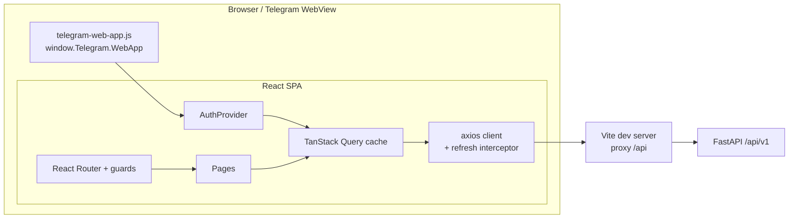
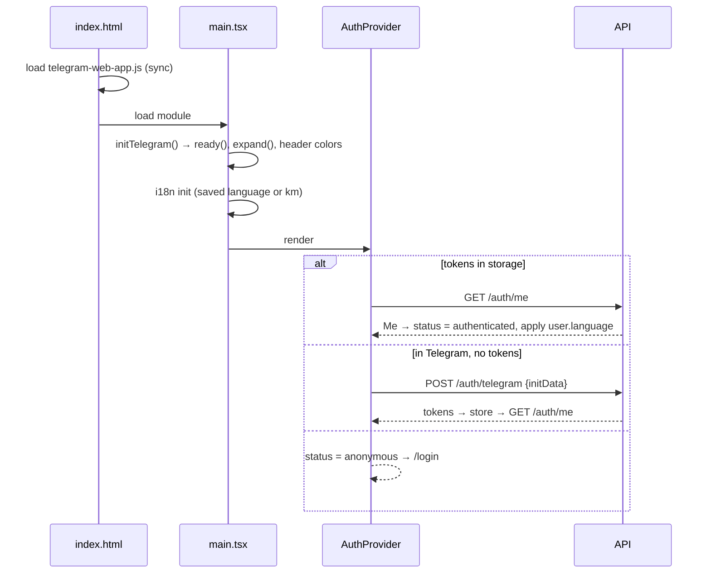
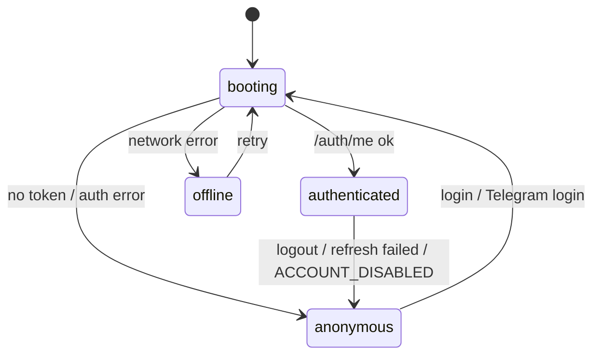
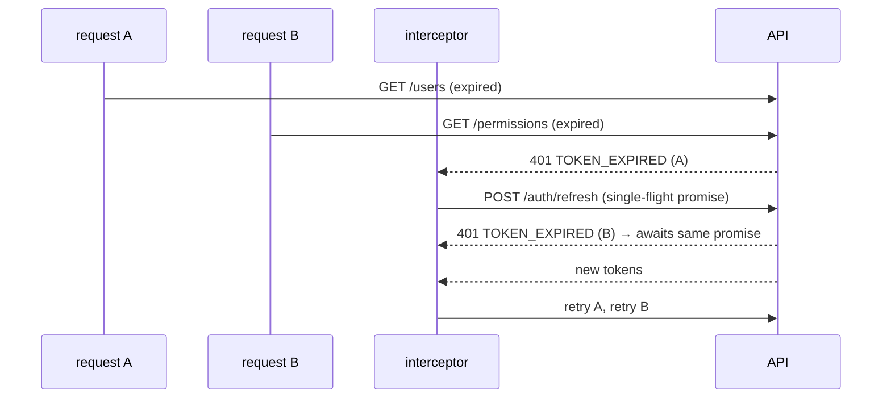

# UI Architecture

How the Mean Chey Grilled Chicken UI is built. For what it *does*, see [FEATURES.md](FEATURES.md). For the backend, see `../meanchey-grilled-chicken-api/docs/ARCHITECTURE.md`.

- [1. Overview](#1-overview)
- [2. Tech stack](#2-tech-stack)
- [3. Source layout](#3-source-layout)
- [4. Boot sequence](#4-boot-sequence)
- [5. Session and auth state](#5-session-and-auth-state)
- [6. API client and token refresh](#6-api-client-and-token-refresh)
- [7. Routing and guards](#7-routing-and-guards)
- [8. Permission-driven UI](#8-permission-driven-ui)
- [9. Layouts and Telegram integration](#9-layouts-and-telegram-integration)
- [10. Server state (TanStack Query)](#10-server-state-tanstack-query)
- [11. Internationalization](#11-internationalization)
- [12. Error handling](#12-error-handling)
- [13. Styling and components](#13-styling-and-components)
- [14. Build, dev server and deployment](#14-build-dev-server-and-deployment)
- [15. Extending the UI](#15-extending-the-ui)
- [16. Design decisions](#16-design-decisions)

---

## 1. Overview



It is a single-page app with no server-side rendering. All data comes from the API. The app holds no business rules beyond UX hints.

## 2. Tech stack

| Concern | Choice |
|---|---|
| Build | Vite 6, TypeScript (strict) |
| UI | React 18 |
| Styling | Tailwind CSS 3; `brand` = Tailwind orange; font Kantumruy Pro (Google Fonts) |
| Routing | React Router 6 (`createBrowserRouter`) |
| Server state | TanStack Query 5 |
| HTTP | axios, with interceptors |
| i18n | i18next + react-i18next (`km` default, `en`) |
| Telegram | Official `telegram-web-app.js` script |

## 3. Source layout

```
src/
├── main.tsx               # initTelegram, QueryClient, AuthProvider, RouterProvider
├── router.tsx             # route tree + guards
├── index.css              # Tailwind + base styles
├── auth/
│   ├── AuthProvider.tsx   # session state machine, login/logout, Telegram auto-login, me query
│   ├── usePermission.ts   # usePermission, useHasRole, useCanAccess
│   ├── Can.tsx            # <Can permission|roles>
│   └── guards.tsx         # RequireAuth, PublicOnly, RequireAccess
├── lib/
│   ├── api.ts             # axios instance, token injection, refresh + session events
│   ├── storage.ts         # safe localStorage + tokenStore
│   ├── errors.ts          # getError, useErrorMessage, ClientError
│   ├── format.ts          # dates, localized names, initials, username normalize
│   ├── telegram.ts        # telegram handle, isTelegramMiniApp, initTelegram
│   ├── paths.ts           # app routes (paths.users, paths.user(id)…), legacy prefixes, parentPath, isUnder
│   ├── types.ts           # API types (mirror of the API schemas)
│   ├── usePositions.ts    # ['user-positions'] query
│   └── useDebounced.ts
├── i18n/                  # i18next init + locales/{km,en}.json
├── layouts/               # AppShell → DesktopLayout | MobileLayout, nav.ts (menu tree), Brand
├── components/            # ui.tsx kit, icons, badges, NavTile, LanguageSwitcher, ProfileMenu, ChangePasswordForm
├── pages/
│   ├── HomePage.tsx, LoginPage.tsx, ChangePasswordPage.tsx, StatusPages.tsx, AuthLayout.tsx
│   ├── production/        # ProductionPage (empty for now)
│   └── settings/          # SettingsPage (hub), AuditLogPage, ProfilePage, users/*
└── types/telegram.d.ts    # minimal Telegram.WebApp typings
```

**Dependency direction:**

```
pages → components, auth, lib → (nothing app-specific)
```

`lib/` never imports React components. `auth/` is the only layer that talks to the session.

## 4. Boot sequence



## 5. Session and auth state

`AuthProvider` exposes this context:

```ts
{
  status,               // 'booting' | 'anonymous' | 'authenticated' | 'offline'
  me,                   // Me | null
  telegramError,        // code from the auto-login, if it failed
  login, loginWithTelegram, logout, refreshMe,
}
```



- **`me` is a TanStack Query** (`['me']`), enabled when an access token exists. The context doesn't copy it; it derives state from the query.
- **Tokens** live in `tokenStore` (`localStorage`, falling back to memory).
- **Login** does three things:
  1. stores the tokens;
  2. clears every cached query, so no data from a previous user leaks into the new session;
  3. flips `hasToken`, which triggers the `me` fetch.
- **Logout** calls `/auth/logout` (best effort), then clears the tokens and the query cache.
- **Offline handling.** A network error on `/auth/me` keeps the tokens and shows *offline* with a retry, instead of logging the user out. Any other error ends the session.
- **Language:**
  - after `me` loads, the user's saved language is applied once per `(user, language)` pair;
  - a later language change made locally, for example while a password change is pending, is not overwritten by refetches.

## 6. API client and token refresh

`lib/api.ts` creates the axios instance at `VITE_API_BASE_URL` (default `/api/v1`).



- **Request interceptor:** adds `Authorization: Bearer <access>`.
- **Response interceptor:**
  - **`401` with `TOKEN_EXPIRED` or `INVALID_TOKEN`:** refresh once and retry.
    - Applies only if a refresh token exists and the request wasn't `/auth/login`, `/auth/telegram` or `/auth/refresh`.
    - Concurrent 401s share **one** refresh promise.
    - The refresh call uses bare `axios`, not the instance, so it can't recurse.
  - **Refresh failure, or `401 ACCOUNT_DISABLED`:** clear the tokens and dispatch `auth:logout`.
  - **`403` with `PASSWORD_CHANGE_REQUIRED`, `MISSING_PERMISSION`, `FORBIDDEN_ROLE` or `FORBIDDEN_SCOPE`:** dispatch `auth:refresh-me`, because the cached `/auth/me` is probably stale. `AuthProvider` refetches it. The guards and menus then redirect to the password change, or drop items the user lost.
- **Window events** decouple the interceptor from React: `AuthProvider` listens and updates state.

## 7. Routing and guards

```
/login                               PublicOnly
<RequireAuth>
  /change-password                   (standalone, AuthLayout)
  <AppShell>
    /                                Home (Production + Settings tiles)
    /production                      ProductionPage
    /settings
      index                          SettingsPage (hub: cards from the nav tree)
      users                          RequireAccess users.view
        index                        UsersList
        new                          RequireAccess users.create → UserForm(create)
        :id                          UserDetail (?tab=permissions)
        :id/edit                     RequireAccess users.update → UserForm(edit)
      audit-logs                     RequireAccess roles=[superadmin, general_manager]
      profile                        Profile
    /users, /users/*                 LegacyRedirect → /settings/users…
    /audit-logs, /audit-logs/*       LegacyRedirect → /settings/audit-logs…
    /profile, /profile/*             LegacyRedirect → /settings/profile…
    *                                NotFound
```

**Paths.** Every frontend URL comes from `lib/paths.ts` (`paths.users`, `paths.user(id)`, `paths.editUser(id)`, …). Components never write route literals, so moving a page is a one-file change. API URLs such as `api.get('/users')` are unrelated and stay literal.

**Legacy redirects.** `LegacyRedirect` swaps the old prefix (from `LEGACY_PREFIXES`) for the new one and keeps the rest of the path, the query string and the hash, e.g. `/users/<id>/edit?x=1#a` → `/settings/users/<id>/edit?x=1#a`.

- It sits inside `RequireAuth`. An old deep link opened while signed out goes through login, `location.state.from` keeps the old path, and after sign-in the redirect sends the user to the new place.
- The redirect routes can be deleted once no old links are in circulation.

| Guard | Behavior |
|---|---|
| `RequireAuth` | See the list below. |
| `PublicOnly` | For `/login`. Sends signed-in users to their original destination (`location.state.from`) or to `/`. |
| `RequireAccess` | Takes `permission` and/or `roles`. Renders `ForbiddenPage` if denied. Works as a layout route (`<Outlet/>`) or as a wrapper around children. |

`RequireAuth` in detail:

- **booting** → spinner.
- **offline** → retry screen.
- **anonymous:**
  - if a Telegram auto-login failed → the Telegram error screen;
  - otherwise → `/login`, remembering where the user was going.
- **password change pending** → only `/change-password` is allowed.
- **`/change-password` without a pending change** → redirected to `/`.

## 8. Permission-driven UI

All checks read `me.permissions` and `me.user.role` from `/auth/me`:

```ts
usePermission('users.create')                    // boolean
useHasRole('superadmin', 'general_manager')      // boolean
useCanAccess()({ permission, roles })            // shared by <Can>, RequireAccess, nav
<Can permission="users.delete" fallback={…}>…</Can>
```

- **Menu tree.** `layouts/nav.ts` declares `NAV_ITEMS` as a tree:

  ```ts
  { to, labelKey, descriptionKey?, icon, permission?, roles?, end?, children? }
  ```

  - **Top level:** Home, Production, Settings.
  - **Settings' `children`:** Users (`users.view`), Audit log (roles `superadmin`, `general_manager`) and My profile. These carry the same rules as before.
- **`useNavItems()`** returns the visible top-level items, each with only its visible children.
  - A section whose children are **all** filtered out is hidden.
  - A section declared with `children: []`, such as Production today, is a real but empty section and stays visible.
  - `useNavChildren(to)` returns one section's visible children.
- **Consumers,** all reading the same tree:
  - the desktop sidebar: top level plus the nested children of the current section;
  - the mobile bottom nav: top level only;
  - the Home tiles: top-level sections, via `NavTile`;
  - the Settings hub: `useNavChildren(paths.settings)`, via `NavTile`.
- **Staff** see only My profile under Settings purely because of these rules. There is no role-specific UI code.
- **Freshness.** Home and the Settings hub call `useRefreshMeWhenStale()`, which adds a `['me']` observer that refetches if the cached copy is more than 60 s old. Combined with the 403 → `auth:refresh-me` rule (§6), a revoked permission disappears from the menus without a reload.
- **Per-object decisions come from the API.**
  - The Permissions tab uses `can_edit` from `GET /users/{id}/permissions`, rather than re-implementing the grant rules in the client.
  - The Create User form offers `me.manageable_roles`.
- **Security boundary:** the API. UI checks only avoid showing dead-end actions.

## 9. Layouts and Telegram integration

- **Layout choice:** `AppShell` picks `MobileLayout` when `isTelegramMiniApp || matchMedia('(max-width: 767px)')`, and `DesktopLayout` otherwise.
- **Desktop:** a sticky 256 px sidebar and a top bar with `LanguageSwitcher` and `ProfileMenu`.
  - The sidebar lists the top-level items.
  - When the route is under a section (`isUnder(pathname, '/settings')`), that section's visible children appear indented below it.
  - The section's own page (`/settings`) is filled; on a child page, the parent keeps the brand color and only the child is filled.
- **Mobile:** a sticky top bar and a fixed bottom nav with exactly the top-level items (Home · Production · Settings). It uses `env(safe-area-inset-bottom)` padding, and the main content reserves space for the nav.
  - The Settings tab is a non-`end` `NavLink`, so it stays active on every `/settings/*` route.
- **Telegram helpers** (`lib/telegram.ts`):
  - `isTelegramMiniApp = Boolean(Telegram.WebApp.initData)`. The script also loads in normal browsers, so the presence of `initData` is the real signal.
  - `initTelegram()` calls `ready()` and `expand()` and sets the header and background colors to match the brand.
  - `MobileLayout` wires Telegram's **BackButton**: hidden on `/`, shown elsewhere.
    - On click it navigates to `parentPath(pathname)`, i.e. the path with its last segment dropped: `/settings/users/:id/edit` → `/settings/users/:id` → `/settings/users` → `/settings` → `/`, and `/production` → `/`.
    - It uses the route tree, not history (`navigate(-1)`), so a deep link opened directly in the Mini App still goes somewhere sensible.
    - In-page `PageHeader` back buttons follow the same parent targets.
- **Auth pages** (login, change password, Telegram error, offline) use `AuthLayout`: a centered card with the brand and language switcher.

## 10. Server state (TanStack Query)

| Query key | Source |
|---|---|
| `['me']` | `GET /auth/me` (staleTime 60 s) |
| `['users', params]` | `GET /users` (`keepPreviousData` for smooth paging and filtering) |
| `['user', id]` | `GET /users/{id}` |
| `['user-permissions', id]` | `GET /users/{id}/permissions` |
| `['user-positions']` | `GET /users/positions`, via `usePositions()` in `lib/usePositions.ts`. Enabled with `users.view`, staleTime 60 s. Feeds the position `<datalist>` suggestions in the user form and the position filter on the users list. |
| `['audit-logs', params]` | `GET /audit-logs` |

- Mutations use `useMutation`. After a change they either write the response straight into the cache (`setQueryData`, e.g. after editing a user or the profile) or invalidate the affected keys: `users`, `user`, `user-permissions`. Creating or editing a user also invalidates `user-positions`, so a newly typed position shows up in the suggestions and filter.
- Defaults: `retry: 1`, `refetchOnWindowFocus: false`. The Telegram WebView focuses and blurs often, so refetching on focus would be noisy.

## 11. Internationalization

- `i18n/index.ts` initializes i18next with the bundled `km.json` and `en.json`.
  - Initial language: the value saved in `localStorage` (`mc.language`), otherwise `km`.
  - `fallbackLng: en`.
  - On every change, `<html lang>` is updated and the choice is saved.
- `setLanguage(lang)` is the single entry point.
- `LanguageSwitcher` calls `setLanguage`. When signed in, and no password change is pending, it also calls `PATCH /me` and writes the result into the `['me']` cache.
- **Key conventions:**

  | Keys | Content |
  |---|---|
  | `roles.*`, `languages.*` | Enum labels. Positions are free text from the user record and are never translated. |
  | `errors.<API_CODE>` | One key per API error code, plus client codes (`PASSWORDS_DO_NOT_MATCH`, `NETWORK_ERROR`, `UNKNOWN`) |
  | `audit.actions.<action with . replaced by _>` | Audit action labels |

- **Server-provided bilingual text** (permission and module names and descriptions) goes through `useLocalized()`, which picks `*_km` or `*_en` with an English fallback.
- **Dates** use `Intl.DateTimeFormat` with the `km-KH` or `en-GB` locale, via `useFormatDate()`.
- **Key parity:** `npm run check:i18n` fails the build step if the two locale files have different keys.

## 12. Error handling

```ts
getError(err) → { code, details }
// ClientError        → its own code
// axios, no response → NETWORK_ERROR
// axios, API body    → error.code / error.details
// otherwise          → UNKNOWN

useErrorMessage()(err) → t(`errors.${code}`, { ...details, time, min })
```

- Details are turned into readable interpolation values. For example, `locked_until` becomes a localized `time`.
- Forms keep the raw error and translate it at render time, so switching language re-translates an error that is already on screen.
- **Client-side validation** throws `ClientError` with the same codes the server uses, for example `PASSWORD_TOO_SHORT`, so messages are identical whichever side caught the problem.

## 13. Styling and components

- **Tailwind utility classes only,** with no CSS modules. `cx()` joins class names.
- **`components/ui.tsx`** is a small in-house kit:
  - `Button` (primary / secondary / danger / ghost, loading state);
  - form controls: `Input`, `Select`, and `Field`, which generates the id and renders the label and hint;
  - containers and feedback: `Card`, `Badge`, `Alert`, `Spinner`, `EmptyState`;
  - page structure: `PageHeader` (optional back button), and `ConfirmDialog` (bottom sheet on mobile, centered on desktop, Escape to close).
- **Icons:** inline SVG paths in `components/icons.tsx`, with no icon dependency.
- **Accessibility:**
  - labelled controls;
  - `role="alert"` on errors;
  - `aria-pressed` on the language toggle;
  - `aria-haspopup` and `aria-expanded` on the profile menu;
  - dialogs with `aria-modal`.

## 14. Build, dev server and deployment

| Command | Purpose |
|---|---|
| `npm run dev` | Vite on `:5173`, `host: true`, `allowedHosts: true` (for ngrok / cloudflared), proxies `/api` → `VITE_API_PROXY_TARGET`. That covers both `/api/v1` and the Telegram webhook `/api/telegram/webhook`, so one tunnel to `:5173` serves the Mini App, the API and the bot. |
| `npm run build` | `tsc --noEmit` then `vite build` → `dist/` |
| `npm run typecheck` | Types only |
| `npm run check:i18n` | Locale key parity |

**Production**

- Serve `dist/` as static files with an SPA fallback, so unknown paths return `index.html`.
- Preferably serve the API from the **same origin** under `/api`. That needs no CORS, and a single HTTPS domain serves the Mini App, the API and the Telegram webhook (`/api/telegram/webhook`). Make sure the reverse proxy forwards all of `/api/*`.
- Otherwise:
  1. build with `VITE_API_BASE_URL=https://api.example.com/api/v1`;
  2. add the UI origin to the API's `CORS_ORIGINS`.
- The Telegram Mini App URL must be **HTTPS**.

## 15. Extending the UI

For a new feature, for example `orders`, after its permissions exist in the API registry, first decide where it lives:

- **Under Production** (most business features), e.g. `/production/orders`;
- **Under Settings** (configuration and admin screens), e.g. `/settings/branches`;
- **A new top-level section**, only for a genuinely separate area. It gets its own sidebar and bottom-nav entry and Home tile, and the bottom bar gets tight beyond 4–5 items.

Then:

1. **Types:** add them to `lib/types.ts`.
2. **Path:** add it to `lib/paths.ts`, e.g. `orders: '/production/orders'`, `order: (id) => …`.
3. **Page:** create `pages/production/orders/…` (or `pages/settings/…`). Fetch data with `useQuery` using a feature-specific key, and give the page a `PageHeader` whose `back` is the parent path.
4. **Route:** nest it under `/production` (or `/settings`) in `router.tsx`, wrapped in `<RequireAccess permission="orders.view">`.
5. **Navigation:** add a child to the section's `children` in `NAV_ITEMS`, with `permission: 'orders.view'`, an icon, `labelKey` and `descriptionKey`. What follows from that:
   - It appears automatically in the sidebar (nested) and, for Settings, as a hub card.
   - Production's page is still a static empty state. When its first child is added, turn `ProductionPage` into a hub like `SettingsPage` (`useNavChildren(paths.production)` + `NavTile`).
   - For a **new top-level section**, add a top-level entry instead. It needs `children` if it has sub-pages, a hub page if it has children, and a `descriptionKey` for its Home tile.
6. **Actions:** wrap them in `<Can permission="orders.create">`.
7. **Strings:** add them to `km.json` **and** `en.json` (label, description, page texts, any new API error codes). Run `npm run check:i18n`.

The Permissions tab and the Telegram back button need no changes. New permissions come from the API, and the back target follows the path structure.

## 16. Design decisions

| Decision | Rationale |
|---|---|
| One app for PC and Mini App | One codebase and one auth flow. Only the layout and sign-in entry point differ. |
| Tokens in `localStorage` | Works inside the Telegram WebView and across reloads. The short access-token lifetime and server-side refresh revocation limit the exposure. An httpOnly cookie setup is a future option if the UI and API share a domain. |
| `/auth/me` as the single source of the user's rights | Menus, guards and forms react to grants and revokes after a refetch, with no client copy of the rules. |
| `can_edit` computed by the server | Keeps the complex grant rules in one place (the API). |
| Window events between the interceptor and React | The interceptor stays framework-agnostic, and session changes flow through one owner (`AuthProvider`). |
| Error codes translated in the client | The API stays language-neutral, and every message, including errors, switches with the language. |
| No component library | Small bundle, full control over Khmer typography, and a consistent mobile/desktop look. |
| Khmer default, English fallback | Matches the primary audience. A missing Khmer string still shows readable English. |
| Two sections (Production, Settings) and a nav tree | Business work and administration are kept apart. The bottom bar stays at three items as features grow, and one tree drives the sidebar, bottom nav, Home tiles and Settings hub. |
| Back = parent route, not history | Mini App sessions often start from a deep link with no history. The route structure always gives a meaningful "up". |
